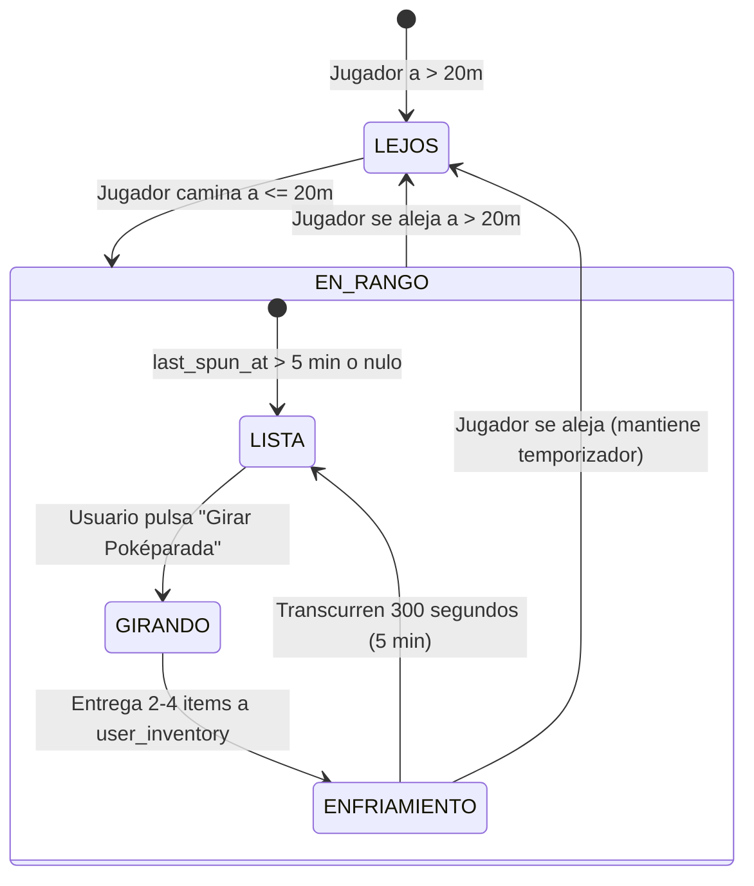

# Especificación Técnica: Módulo 4 - Interacción con Poképaradas, Gimnasios y Motor de Spawning

**Estado:** Borrador Pendiente de Aprobación  
**Módulo del PDF:** Módulo 3 — Poképaradas, Gimnasios y Spawning de Criaturas  
**Dependencias:** Expo SDK 57, React Native 0.86.3, Supabase (PostgreSQL 3FN + Realtime), Mapbox (`@rnmapbox/maps`), React Native Reanimated (Worklets)  
**Autor:** Antigravity (AI Pair Programmer)  
**Fecha:** 2026-10-04  

---

## 1. Alcance y Objetivos

El objetivo de este módulo es dotar al mapa interactivo de mecánicas de juego activas:
1. **Interacción con Poképaradas:**
   - Detección geodésica estricta de proximidad a menos de **20 metros** ($d \le 20$ m).
   - Mecánica de giro ("Spin") que entrega entre 2 y 4 objetos aleatorios (Pokéballs, Superballs, Ultraballs, Pociones, Revives) actualizando el inventario en Supabase.
   - Temporizador de enfriamiento (*Cooldown*) de **5 minutos (300 segundos)** por Poképarada.
   - Diferenciación visual en el mapa: **Azul** (disponible para giro) vs. **Morado** (en enfriamiento con temporizador regresivo).
2. **Interacción con Gimnasios:**
   - Detección de proximidad geodésica a **40 metros** ($d \le 40$ m).
   - Inspección de estado: Equipo dominante (`mystic`, `valor`, `instinct`, `neutral`), Pokémon defensor, nivel de combate y puntos de salud.
   - Bloqueo por lejanía si $d > 40$ m.
3. **Motor de Spawning Autónomo:**
   - Generación de criaturas salvajes distribuidas geoespacialmente dentro de los perímetros autorizados (Campus UniSabana y Sector Buena Suerte Cajicá).
   - Tiempo de vida limitado (*Time-To-Live / TTL*) de **10 a 15 minutos** por spawn; luego la criatura expira y desaparece.
   - Distribución de probabilidad por rareza (Común: 60%, Poco Común: 25%, Rara: 12%, Épica/Legendaria: 3%).
4. **Validación de Radio Visual de 30 Metros:**
   - Las criaturas salvajes activas solo se renderizan y son visibles en el mapa si la distancia euclidiana/geodésica entre el jugador y el spawn es **menor o igual a 30 metros** ($d \le 30$ m).
   - Tocar una criatura visible abre el diálogo de encuentro preparando la transición a la pantalla de Captura AR (Etapa 5).

---

## 2. Fundamentos Matemáticos y Algoritmos

### 2.1 Fórmula de Haversine para Distancia Geodésica
Para determinar si el entrenador se encuentra dentro del radio de interacción ($20$m para Poképaradas, $40$m para Gimnasios y $30$m para avistamiento de Pokémon), se calcula la distancia sobre el elipsoide terrestre mediante la fórmula de Haversine:

$$\Delta \phi = \frac{\pi}{180} (\text{lat}_2 - \text{lat}_1), \quad \Delta \lambda = \frac{\pi}{180} (\text{lon}_2 - \text{lon}_1)$$

$$a = \sin^2\left(\frac{\Delta \phi}{2}\right) + \cos\left(\frac{\pi}{180}\text{lat}_1\right) \cos\left(\frac{\pi}{180}\text{lat}_2\right) \sin^2\left(\frac{\Delta \lambda}{2}\right)$$

$$c = 2 \cdot \text{atan2}\left(\sqrt{a}, \sqrt{1 - a}\right)$$

$$d = R \cdot c$$

Donde $R = 6,371,000$ metros (radio medio de la Tierra).

> **Optimización Crítica:** Esta función se implementará como un **Worklet** (`'worklet';`) en [`src/utils/haversine.ts`](file:///c:/Users/kenny/OneDrive/Documents/Cosas%20de%20movil%20que%20lo%20buguie%20todo/PokemonGoExam/PokemonGoExam/src/utils/haversine.ts) para ejecutarse en el UI Thread de C++ sin sobrecargar el event loop de JavaScript.

### 2.2 Distribución Ponderada de Rareza de Spawns
El generador de criaturas asigna probabilidades según la clasificación matemática de especies:
- **Tier 1 - Comunes ($60\%$):** 
  $P \in [0.00, 0.60) \implies$ Pidgey, Rattata, Caterpie, Weedle, Zubat, Oddish, Poliwag, Bellsprout, Geodude, etc.
- **Tier 2 - Poco Comunes ($25\%$):** 
  $P \in [0.60, 0.85) \implies$ Pikachu, Eevee, Bulbasaur, Charmander, Squirtle, Vulpix, Growlithe, Abra, Machop, Gastly, etc.
- **Tier 3 - Raras ($12\%$):** 
  $P \in [0.85, 0.97) \implies$ Snorlax, Lapras, Dratini, Scyther, Magmar, Electabuzz, Gyarados, Alakazam, Gengar, etc.
- **Tier 4 - Épicas / Míticas ($3\%$):** 
  $P \in [0.97, 1.00] \implies$ Dragonite, Articuno, Zapdos, Moltres, Mewtwo, Mew.

---

## 3. Modelo de Base de Datos y Persistencia (Supabase)

Se incorporarán dos tablas relacionales optimizadas:

```sql
-- 1. Registro de Enfriamiento de Poképaradas por Entrenador
CREATE TABLE IF NOT EXISTS public.user_pokestop_cooldowns (
    id UUID PRIMARY KEY DEFAULT gen_random_uuid(),
    user_id UUID NOT NULL,
    pokestop_id UUID NOT NULL REFERENCES public.pokestops(id) ON DELETE CASCADE,
    last_spun_at TIMESTAMPTZ NOT NULL DEFAULT now(),
    UNIQUE (user_id, pokestop_id)
);

CREATE INDEX IF NOT EXISTS idx_cooldowns_user_stop 
ON public.user_pokestop_cooldowns (user_id, pokestop_id);

-- 2. Motor de Spawns Activos con TTL
CREATE TABLE IF NOT EXISTS public.active_spawns (
    id UUID PRIMARY KEY DEFAULT gen_random_uuid(),
    pokemon_id INT NOT NULL REFERENCES public.pokemon_base(id) ON DELETE CASCADE,
    latitude DOUBLE PRECISION NOT NULL,
    longitude DOUBLE PRECISION NOT NULL,
    spawned_at TIMESTAMPTZ NOT NULL DEFAULT now(),
    expires_at TIMESTAMPTZ NOT NULL,
    iv_attack INT NOT NULL CHECK (iv_attack BETWEEN 0 AND 15),
    iv_defense INT NOT NULL CHECK (iv_defense BETWEEN 0 AND 15),
    iv_hp INT NOT NULL CHECK (iv_hp BETWEEN 0 AND 15),
    cp INT NOT NULL,
    is_active BOOLEAN NOT NULL DEFAULT true
);

CREATE INDEX IF NOT EXISTS idx_active_spawns_coords 
ON public.active_spawns (latitude, longitude);

CREATE INDEX IF NOT EXISTS idx_active_spawns_expiry 
ON public.active_spawns (expires_at) WHERE is_active = true;

-- Habilitar RLS
ALTER TABLE public.user_pokestop_cooldowns ENABLE ROW LEVEL SECURITY;
ALTER TABLE public.active_spawns ENABLE ROW LEVEL SECURITY;

CREATE POLICY "Spawns activos legibles por todos" 
ON public.active_spawns FOR SELECT USING (is_active = true AND expires_at > now());

CREATE POLICY "Cooldowns de pokeparadas legibles por todos" 
ON public.user_pokestop_cooldowns FOR SELECT USING (true);

CREATE POLICY "Cooldowns de pokeparadas modificables" 
ON public.user_pokestop_cooldowns FOR ALL USING (true);
```

---

## 4. Contratos de TypeScript

Se definirán en [`src/types/spawns.ts`](file:///c:/Users/kenny/OneDrive/Documents/Cosas%20de%20movil%20que%20lo%20buguie%20todo/PokemonGoExam/PokemonGoExam/src/types/spawns.ts) y [`src/types/interaction.ts`](file:///c:/Users/kenny/OneDrive/Documents/Cosas%20de%20movil%20que%20lo%20buguie%20todo/PokemonGoExam/PokemonGoExam/src/types/interaction.ts):

```typescript
import type { Coordinate } from './map';
import type { PokemonBase } from './pokemon';

export interface ActiveSpawn {
  id: string;
  pokemon_id: number;
  latitude: number;
  longitude: number;
  spawned_at: string;
  expires_at: string;
  iv_attack: number;
  iv_defense: number;
  iv_hp: number;
  cp: number;
  is_active: boolean;
  pokemon?: PokemonBase;
  // Campos calculados en cliente
  distance_meters?: number;
  is_in_range?: boolean; // <= 30m
}

export interface PokestopCooldown {
  pokestop_id: string;
  last_spun_at: string;
  remaining_seconds: number;
  can_spin: boolean;
}

export interface PokestopRewardItem {
  item_type: 'pokeball' | 'greatball' | 'ultraball' | 'potion' | 'superpotion' | 'revive';
  quantity: number;
  label: string;
  emoji: string;
}

export interface GymDetails {
  id: string;
  name: string;
  latitude: number;
  longitude: number;
  current_team: 'mystic' | 'valor' | 'instinct' | 'neutral';
  interaction_radius_meters: number;
  defending_instance?: {
    pokemon_name: string;
    sprite_url: string;
    cp: number;
    current_hp: number;
    trainer_name?: string;
  } | null;
}
```

---

## 5. Máquinas de Estados y Lógica de Interacción

### 5.1 Poképarada


- **Color en el Mapa:**
  - Azul `#2563EB`: Lista para girar.
  - Morado `#9333EA`: En enfriamiento (bloqueada hasta que expire el cooldown).

### 5.2 Spawn de Criaturas (Visual Radius 30m)


---

## 6. Escenarios de Aceptación (Gherkin)

### Escenario 1: Giro Exitoso de Poképarada en Radio < 20m
- **Given** que el entrenador se encuentra a 14 metros de la *«Poképarada Sector Buena Suerte»*.
- **And** la Poképarada no ha sido girada en los últimos 5 minutos (`can_spin = true`).
- **When** el usuario abre el modal de la Poképarada y pulsa el disco giratorio o el botón *«Girar Poképarada»*.
- **Then** se otorgan entre 2 y 4 objetos aleatorios (ej. 2 Pokéballs y 1 Poción).
- **And** se actualiza el stock en la tabla `user_inventory`.
- **And** la Poképarada cambia su color a Morado `#9333EA` en el mapa.
- **And** se inicia el contador regresivo de 5 minutos (300s).

### Escenario 2: Intento de Giro Fuera de Rango (> 20m)
- **Given** que el entrenador se encuentra a 35 metros de la Poképarada.
- **When** toca la Poképarada en el mapa.
- **Then** el modal se abre indicando: *«Estás demasiado lejos (a 35 m). Acércate a menos de 20 metros para girarla»*.
- **And** el botón de giro permanece desactivado e inhabilitado.

### Escenario 3: Poképarada en Enfriamiento (Cooldown)
- **Given** que el usuario giró la Poképarada hace 2 minutos (quedan 180 segundos).
- **When** vuelve a tocar la Poképarada estando a 10 metros.
- **Then** el modal muestra el indicador: *«Poképarada en enfriamiento. Vuelve en 03:00»*.
- **And** no se otorgan objetos adicionales.

### Escenario 4: Avistamiento de Criatura dentro del Radio Visual de 30m
- **Given** que existe un Pikachu activo con `expires_at > now()`.
- **When** el entrenador camina físicamente y reduce la distancia geodésica a 25 metros ($d \le 30$ m).
- **Then** el sprite de Pikachu aparece dinámicamente en el mapa con animación de aparición suave.
- **And** al tocar a Pikachu, se despliega la tarjeta de encuentro mostrando sus Puntos de Combate (CP) y el botón *«Iniciar Captura»*.

### Escenario 5: Criatura Fuera del Radio Visual (> 30m)
- **Given** un Charmander generado en las canchas de UniSabana a 80 metros del jugador.
- **When** se evalúa la distancia en el cliente con el Worklet de Haversine.
- **Then** el marcador de Charmander permanece estrictamente oculto (`display: none` / no instanciado en Mapbox) para preservar la sensación de descubrimiento y ahorrar memoria GPU.

---

## 7. Plan de Archivos a Crear y Modificar

| Acción | Archivo | Responsabilidad |
|---|---|---|
| **Crear** | `src/utils/haversine.ts` | Algoritmo de Haversine optimizado con directiva `'worklet';` para cálculo geodésico a 60 FPS |
| **Crear** | `src/types/spawns.ts` | Interfaces de TypeScript para Spawns activos, rangos visuales y TTL |
| **Crear** | `src/types/interaction.ts` | Contratos para recompensas de Poképaradas, cooldowns y estado de Gimnasios |
| **Crear** | `src/services/spawnEngine.ts` | Servicio de sincronización y generación de spawns en Supabase |
| **Crear** | `src/services/inventoryService.ts` | Servicio transaccional para otorgar y consultar items del inventario |
| **Crear** | `src/components/PokestopModal.tsx` | Modal interactivo de Poképarada con disco giratorio, cooldown de 5 min y entrega de items |
| **Crear** | `src/components/GymModal.tsx` | Modal de Gimnasio con equipo defensor, radio de 40m e inspección |
| **Crear** | `src/components/WildPokemonMarker.tsx` | Marcador Mapbox para criaturas salvajes con filtrado visual de 30 metros |
| **Modificar** | `src/screens/MapScreen.tsx` | Integración de spawns de 30m, modales de Poképarada y Gimnasio, y colores por cooldown |
| **Crear** | `scraper/spawn_seeder.sql` | DDL de `user_pokestop_cooldowns` y `active_spawns` con índices espaciales en Supabase |
| **Crear** | `docs/README_MODULO_4.md` | Documentación técnica con guía de pruebas en vivo y 3 preguntas de sustentación |

---

## 8. Verificación y Criterios de Éxito

1. **Pruebas Estáticas:** `npx tsc --noEmit` debe arrojar 0 errores.
2. **Cero Bloat:** Los modales y animaciones del disco giratorio emplean componentes nativos (`Modal`, `Animated` / `Reanimated`, `StyleSheet`).
3. **Persistencia en Vivo:** Al girar una Poképarada, los items aparecen reflejados de inmediato en la tabla `user_inventory` de Supabase y en la pestaña de *Mochila*.
4. **Independencia de Red:** Si el usuario camina por su barrio en Cajicá o en UniSabana, el cálculo de 20m, 30m y 40m responde en tiempo real con el GPS nativo.
