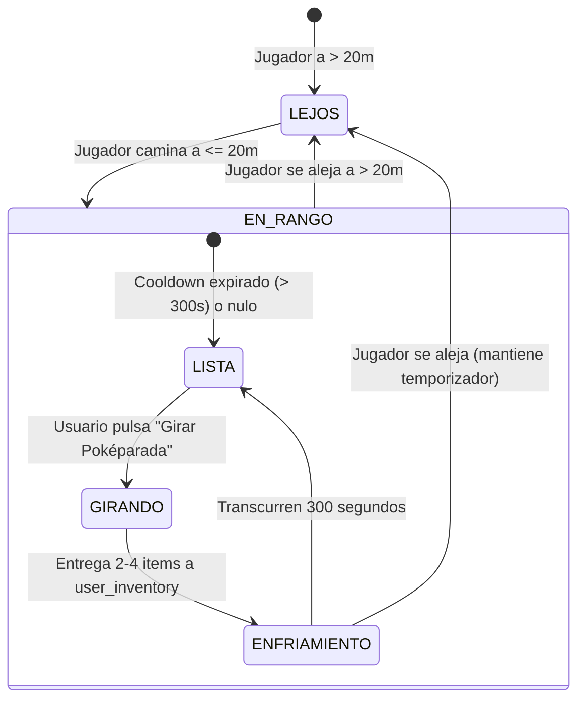
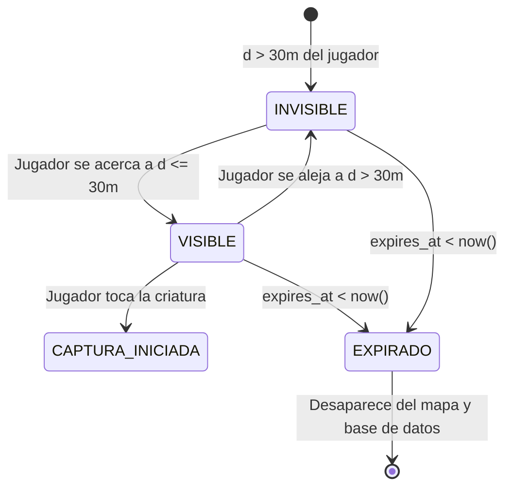

# Especificación Técnica: Módulo 4 - Interacción con Poképaradas, Gimnasios, Motor de Spawning y Sistema Dinámico de Zonas

**Estado:** Borrador Actualizado para Aprobación  
**Módulo del PDF:** Módulo 3 — Poképaradas, Gimnasios y Spawning de Criaturas  
**Dependencias:** Expo SDK 57, React Native 0.86.3, Supabase (PostgreSQL 3FN + Realtime), Mapbox (`@rnmapbox/maps`), React Native Reanimated (Worklets)  
**Autor:** Antigravity (AI Pair Programmer)  
**Fecha:** 2026-10-04  

---

## 1. Alcance y Objetivos

El objetivo de este módulo es dotar al mapa interactivo de mecánicas de juego activas respetando al 100% los criterios de evaluación del parcial:
1. **Sistema Dinámico de Zonas y Modo de Desarrollo (Feature Flag):**
   - Control de entornos mediante la variable `EXPO_PUBLIC_ENABLE_TEST_ZONE`.
   - Si `EXPO_PUBLIC_ENABLE_TEST_ZONE=false` (Producción / Evaluación): El geofence, los POIs y los spawns quedan restringidos **exclusivamente al Campus de la Universidad de La Sabana en Chía**, garantizando el cumplimiento estricto de la rúbrica oficial.
   - Si `EXPO_PUBLIC_ENABLE_TEST_ZONE=true` (Desarrollo / Pruebas Locales): Se habilita la zona secundaria del **Sector Buena Suerte en Cajicá** junto con sus POIs y generadores de criaturas para validación funcional caminando en la vida real.
2. **Interacción con Poképaradas:**
   - Detección geodésica de proximidad a menos de **20 metros** ($d \le 20$ m).
   - Mecánica de giro ("Spin") que entrega entre 2 y 4 objetos aleatorios (Pokéballs, Superballs, Ultraballs, Pociones, Revives) actualizando `user_inventory` en Supabase.
   - Temporizador de enfriamiento (*Cooldown*) de **5 minutos (300 segundos)** por Poképarada.
   - Diferenciación visual en el mapa: **Azul** (disponible para giro) vs. **Morado** (en enfriamiento con temporizador mm:ss).
3. **Interacción con Gimnasios:**
   - Detección de proximidad geodésica a **40 metros** ($d \le 40$ m).
   - Inspección de estado: Equipo dominante (`mystic`, `valor`, `instinct`, `neutral`), Pokémon defensor, nivel de combate y puntos de salud.
   - Bloqueo por lejanía si $d > 40$ m.
4. **Motor de Spawning Autónomo:**
   - Generación de criaturas salvajes distribuidas geoespacialmente dentro de los límites de la(s) zona(s) activa(s).
   - Tiempo de vida limitado (*Time-To-Live / TTL*) de **10 a 15 minutos** por spawn; luego la criatura expira y desaparece de la base de datos.
   - Distribución de probabilidad por rareza (Común: 60%, Poco Común: 25%, Rara: 12%, Épica/Legendaria: 3%).
5. **Validación de Radio Visual de 30 Metros:**
   - Las criaturas salvajes activas solo se renderizan y son visibles en el mapa si la distancia entre el jugador y el spawn es **menor o igual a 30 metros** ($d \le 30$ m).
   - Tocar una criatura visible abre el diálogo de encuentro preparando la transición a la pantalla de Captura AR (Etapa 5).

---

## 2. Sistema Dinámico de Zonas y Modo de Desarrollo (Feature Flag)

Para proteger la integridad de la entrega final y evitar penalizaciones en la rúbrica institucional, la arquitectura implementa un desacoplamiento estricto por configuración:

### 2.1 Configuración de Entornos (`.env`)
```env
# Modo Oficial para la Evaluación / Sustentación (Estricto UniSabana):
EXPO_PUBLIC_ENABLE_TEST_ZONE=false

# Modo Pruebas Locales (UniSabana + Sector Buena Suerte Cajicá):
# EXPO_PUBLIC_ENABLE_TEST_ZONE=true
```

### 2.2 Matriz de Comportamiento por Estado de la Bandera

| Componente / Servicio | `EXPO_PUBLIC_ENABLE_TEST_ZONE = false` (Oficial) | `EXPO_PUBLIC_ENABLE_TEST_ZONE = true` (Desarrollo) |
|---|---|---|
| **Geofencing Perimetral** | Solo polígono de **Campus UniSabana** (`UNISABANA_POLYGON`). Fuera de Chía se bloquea la app. | Polígonos de **UniSabana** y **Sector Buena Suerte (Cajicá)** activos simultáneamente. |
| **Renderizado en Mapbox** | Dibuja únicamente el contorno cian del campus UniSabana. | Dibuja los polígonos perimetrales de ambas zonas. |
| **Carga de Poképaradas/Gimnasios** | `WHERE is_test_zone = false` (Solo los 5 hitos oficiales del campus). | Carga todos los POIs (UniSabana + POIs de prueba en Cajicá). |
| **Motor de Spawning** | Genera y consulta spawns únicamente dentro del campus UniSabana. | Genera y consulta spawns tanto en UniSabana como en Cajicá. |
| **Lógica Algorítmica** | **Idéntica:** Mismo algoritmo Ray-Casting y Haversine en Worklet. | **Idéntica:** Mismo algoritmo Ray-Casting y Haversine en Worklet. |

---

## 3. Fundamentos Matemáticos y Algoritmos

### 3.1 Fórmula de Haversine para Distancia Geodésica
Para determinar si el entrenador se encuentra dentro del radio de interacción ($20$m para Poképaradas, $40$m para Gimnasios y $30$m para avistamiento de Pokémon), se calcula la distancia sobre el elipsoide terrestre mediante la fórmula de Haversine:

$$\Delta \phi = \frac{\pi}{180} (\text{lat}_2 - \text{lat}_1), \quad \Delta \lambda = \frac{\pi}{180} (\text{lon}_2 - \text{lon}_1)$$

$$a = \sin^2\left(\frac{\Delta \phi}{2}\right) + \cos\left(\frac{\pi}{180}\text{lat}_1\right) \cos\left(\frac{\pi}{180}\text{lat}_2\right) \sin^2\left(\frac{\Delta \lambda}{2}\right)$$

$$c = 2 \cdot \text{atan2}\left(\sqrt{a}, \sqrt{1 - a}\right)$$

$$d = R \cdot c$$

Donde $R = 6,371,000$ metros (radio medio de la Tierra).

> **Optimización Crítica:** Esta función se implementará con la directiva `'worklet';` en [`src/utils/haversine.ts`](file:///c:/Users/kenny/OneDrive/Documents/Cosas%20de%20movil%20que%20lo%20buguie%20todo/PokemonGoExam/PokemonGoExam/src/utils/haversine.ts) para ejecutarse en el runtime de C++ de Reanimated a 60/120 FPS sin penalizar el hilo de JavaScript.

### 3.2 Distribución Ponderada de Rareza de Spawns
El generador de criaturas asigna probabilidades según la clasificación matemática de especies de Primera Generación:
- **Tier 1 - Comunes ($60\%$):** 
  $P \in [0.00, 0.60) \implies$ Pidgey, Rattata, Caterpie, Weedle, Zubat, Oddish, Poliwag, Bellsprout, Geodude, etc.
- **Tier 2 - Poco Comunes ($25\%$):** 
  $P \in [0.60, 0.85) \implies$ Pikachu, Eevee, Bulbasaur, Charmander, Squirtle, Vulpix, Growlithe, Abra, Machop, Gastly, etc.
- **Tier 3 - Raras ($12\%$):** 
  $P \in [0.85, 0.97) \implies$ Snorlax, Lapras, Dratini, Scyther, Magmar, Electabuzz, Gyarados, Alakazam, Gengar, etc.
- **Tier 4 - Épicas / Legendarias ($3\%$):** 
  $P \in [0.97, 1.00] \implies$ Dragonite, Articuno, Zapdos, Moltres, Mewtwo, Mew.

---

## 4. Modelo de Base de Datos y Persistencia (Supabase)

```sql
-- 1. Agregar columna is_test_zone a POIs existentes
ALTER TABLE public.pokestops ADD COLUMN IF NOT EXISTS is_test_zone BOOLEAN NOT NULL DEFAULT false;
ALTER TABLE public.gymnasiums ADD COLUMN IF NOT EXISTS is_test_zone BOOLEAN NOT NULL DEFAULT false;

-- Marcar POIs de Cajicá como de prueba
UPDATE public.pokestops SET is_test_zone = true WHERE name LIKE '%Cajicá%' OR name LIKE '%Buena Suerte%';
UPDATE public.gymnasiums SET is_test_zone = true WHERE name LIKE '%Cajicá%';

-- 2. Registro de Enfriamiento de Poképaradas por Entrenador
CREATE TABLE IF NOT EXISTS public.user_pokestop_cooldowns (
    id UUID PRIMARY KEY DEFAULT gen_random_uuid(),
    user_id UUID NOT NULL,
    pokestop_id UUID NOT NULL REFERENCES public.pokestops(id) ON DELETE CASCADE,
    last_spun_at TIMESTAMPTZ NOT NULL DEFAULT now(),
    UNIQUE (user_id, pokestop_id)
);

CREATE INDEX IF NOT EXISTS idx_cooldowns_user_stop 
ON public.user_pokestop_cooldowns (user_id, pokestop_id);

-- 3. Motor de Spawns Activos con TTL
CREATE TABLE IF NOT EXISTS public.active_spawns (
    id UUID PRIMARY KEY DEFAULT gen_random_uuid(),
    pokemon_id INT NOT NULL REFERENCES public.pokemon_base(id) ON DELETE CASCADE,
    latitude DOUBLE PRECISION NOT NULL,
    longitude DOUBLE PRECISION NOT NULL,
    is_test_zone BOOLEAN NOT NULL DEFAULT false,
    spawned_at TIMESTAMPTZ NOT NULL DEFAULT now(),
    expires_at TIMESTAMPTZ NOT NULL,
    iv_attack INT NOT NULL CHECK (iv_attack BETWEEN 0 AND 15),
    iv_defense INT NOT NULL CHECK (iv_defense BETWEEN 0 AND 15),
    iv_hp INT NOT NULL CHECK (iv_hp BETWEEN 0 AND 15),
    cp INT NOT NULL,
    is_active BOOLEAN NOT NULL DEFAULT true
);

CREATE INDEX IF NOT EXISTS idx_active_spawns_coords 
ON public.active_spawns (latitude, longitude);

CREATE INDEX IF NOT EXISTS idx_active_spawns_expiry 
ON public.active_spawns (expires_at) WHERE is_active = true;

-- Políticas RLS
ALTER TABLE public.user_pokestop_cooldowns ENABLE ROW LEVEL SECURITY;
ALTER TABLE public.active_spawns ENABLE ROW LEVEL SECURITY;

CREATE POLICY "Spawns activos legibles por todos" 
ON public.active_spawns FOR SELECT USING (is_active = true AND expires_at > now());

CREATE POLICY "Cooldowns de pokeparadas legibles por todos" 
ON public.user_pokestop_cooldowns FOR SELECT USING (true);

CREATE POLICY "Cooldowns de pokeparadas modificables" 
ON public.user_pokestop_cooldowns FOR ALL USING (true);
```

---

## 5. Contratos de TypeScript

Se definirán en [`src/types/spawns.ts`](file:///c:/Users/kenny/OneDrive/Documents/Cosas%20de%20movil%20que%20lo%20buguie%20todo/PokemonGoExam/PokemonGoExam/src/types/spawns.ts) y [`src/types/interaction.ts`](file:///c:/Users/kenny/OneDrive/Documents/Cosas%20de%20movil%20que%20lo%20buguie%20todo/PokemonGoExam/PokemonGoExam/src/types/interaction.ts):

```typescript
import type { Coordinate } from './map';
import type { PokemonBase } from './pokemon';

export interface ActiveSpawn {
  id: string;
  pokemon_id: number;
  latitude: number;
  longitude: number;
  is_test_zone: boolean;
  spawned_at: string;
  expires_at: string;
  iv_attack: number;
  iv_defense: number;
  iv_hp: number;
  cp: number;
  is_active: boolean;
  pokemon?: PokemonBase;
  // Campos calculados reactivamente en el cliente
  distance_meters?: number;
  is_in_range?: boolean; // <= 30m
}

export interface PokestopCooldown {
  pokestop_id: string;
  last_spun_at: string;
  remaining_seconds: number;
  can_spin: boolean;
}

export interface PokestopRewardItem {
  item_type: 'pokeball' | 'greatball' | 'ultraball' | 'potion' | 'superpotion' | 'revive';
  quantity: number;
  label: string;
  emoji: string;
}

export interface GymDetails {
  id: string;
  name: string;
  latitude: number;
  longitude: number;
  is_test_zone: boolean;
  current_team: 'mystic' | 'valor' | 'instinct' | 'neutral';
  interaction_radius_meters: number;
  defending_instance?: {
    pokemon_name: string;
    sprite_url: string;
    cp: number;
    current_hp: number;
    trainer_name?: string;
  } | null;
}
```

---

## 6. Máquinas de Estados y Lógica de Interacción

### 6.1 Poképarada


- **Colores en el Mapa:**
  - Azul `#2563EB`: Lista para girar.
  - Morado `#9333EA`: En enfriamiento (bloqueada hasta cumplir los 5 min).

### 6.2 Spawn de Criaturas (Radio Visual de 30m)


---

## 7. Escenarios de Aceptación (Gherkin)

### Escenario 1: Modo Estricto para Evaluación (`EXPO_PUBLIC_ENABLE_TEST_ZONE=false`)
- **Given** que `EXPO_PUBLIC_ENABLE_TEST_ZONE` es `false`.
- **When** se inicia la aplicación y se evalúan las zonas de juego.
- **Then** el geofencing restringe el juego al campus de UniSabana en Chía.
- **And** en el mapa solo se dibujan las Poképaradas y Gimnasios oficiales del campus (Biblioteca, Ad Portas, etc.).
- **And** los POIs y polígonos de Cajicá quedan estrictamente excluidos.

### Escenario 2: Modo Desarrollo Activo (`EXPO_PUBLIC_ENABLE_TEST_ZONE=true`)
- **Given** que `EXPO_PUBLIC_ENABLE_TEST_ZONE` es `true`.
- **When** el usuario abre la app en el Sector Buena Suerte de Cajicá.
- **Then** el geofencing reconoce la zona como autorizada y no bloquea la pantalla.
- **And** se renderizan la Poképarada y el Gimnasio de prueba de Cajicá además de los de UniSabana.

### Escenario 3: Giro Exitoso de Poképarada en Radio < 20m
- **Given** que el entrenador se encuentra a 12 metros de una Poképarada activa.
- **And** la Poképarada no ha sido girada en los últimos 5 minutos (`can_spin = true`).
- **When** el usuario abre el modal y pulsa *«Girar Poképarada»*.
- **Then** se otorgan entre 2 y 4 objetos aleatorios (ej. 2 Pokéballs y 1 Poción).
- **And** se persiste el nuevo stock en la tabla `user_inventory`.
- **And** la Poképarada cambia su color a Morado `#9333EA` en el mapa.
- **And** se inicia la cuenta regresiva de 5 minutos (300s).

### Escenario 4: Intento de Giro Fuera de Rango (> 20m)
- **Given** que el entrenador se encuentra a 32 metros de la Poképarada.
- **When** toca la Poképarada en el mapa.
- **Then** el modal indica: *«Estás demasiado lejos (a 32 m). Acércate a menos de 20 metros para girarla»*.
- **And** el botón de giro permanece deshabilitado.

### Escenario 5: Avistamiento de Criatura dentro del Radio Visual de 30m
- **Given** un Pokémon salvaje generado con `expires_at > now()`.
- **When** el entrenador camina y reduce la distancia geodésica a 24 metros ($d \le 30$ m).
- **Then** el sprite de la criatura aparece en el mapa con animación suave.
- **And** al tocarlo, se despliega la tarjeta de avistamiento con su CP y el botón para iniciar captura.

### Escenario 6: Criatura Fuera del Radio Visual (> 30m)
- **Given** un Pokémon salvaje a 65 metros del entrenador.
- **When** se evalúa la distancia con el Worklet de Haversine.
- **Then** la criatura permanece completamente invisible y oculta en el mapa.

---

## 8. Plan de Archivos a Crear y Modificar

| Acción | Archivo | Responsabilidad |
|---|---|---|
| **Crear** | `src/utils/haversine.ts` | Algoritmo de Haversine optimizado con directiva `'worklet';` para cálculo a 60 FPS |
| **Modificar** | `src/utils/geofence.ts` | Implementación de `getActivePolygons()` y `isPointInAuthorizedZonesWorklet` condicionado a `EXPO_PUBLIC_ENABLE_TEST_ZONE` |
| **Crear** | `src/types/spawns.ts` | Interfaces de TypeScript para Spawns activos, rangos visuales y TTL |
| **Crear** | `src/types/interaction.ts` | Contratos para recompensas de Poképaradas, cooldowns y estado de Gimnasios |
| **Crear** | `src/services/spawnEngine.ts` | Motor de generación y consulta de spawns con filtro de TTL y zona activa |
| **Crear** | `src/services/inventoryService.ts` | Servicio transaccional para otorgar y consultar items del inventario |
| **Crear** | `src/components/PokestopModal.tsx` | Modal de Poképarada con disco giratorio, cooldown de 5 min y entrega de items |
| **Crear** | `src/components/GymModal.tsx` | Modal de Gimnasio con equipo defensor, radio de 40m e inspección |
| **Crear** | `src/components/WildPokemonMarker.tsx` | Marcador Mapbox para criaturas salvajes con filtrado visual de 30 metros |
| **Modificar** | `src/screens/MapScreen.tsx` | Integración de spawns de 30m, modales de Poképarada/Gimnasio y filtrado de POIs por zona |
| **Crear** | `scraper/spawn_schema.sql` | DDL de `user_pokestop_cooldowns`, `active_spawns` y migración `is_test_zone` en Supabase |
| **Crear** | `docs/README_MODULO_4.md` | Documentación técnica con guía de pruebas en vivo y 3 preguntas de sustentación |

---

## 9. Criterios de Aceptación y Verificación

1. **Tipado Estricto:** `npx tsc --noEmit` debe pasar con 0 errores.
2. **Cero Bloat:** Los modales y animaciones del disco giratorio emplean componentes nativos (`Modal`, `Animated` / `Reanimated`, `StyleSheet`).
3. **Alineación con la Rúbrica del Parcial:**
   - Con `EXPO_PUBLIC_ENABLE_TEST_ZONE=false`, la app se comporta de forma idéntica al 100% de la rúbrica institucional (Chía / UniSabana exclusivamente).
   - Con `EXPO_PUBLIC_ENABLE_TEST_ZONE=true`, permite la verificación local en Cajicá sin duplicar código ni alterar fórmulas matemáticas.
