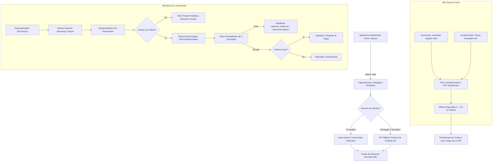

# Especificación Técnica: Módulo 5 — Modo Captura con Realidad Aumentada (Cámara, Sensores y Física Balística de Lanzamiento)

**Estado:** Borrador Completo para Aprobación  
**Módulo del PDF Oficial:** Módulo 4 — Modo Captura (Cámara y Física Balística de Lanzamiento)  
**Dependencias:** Expo SDK 57, React Native 0.86.3, `expo-camera` (~57.0.6), `expo-sensors` (~57.0.3), `react-native-gesture-handler` (~2.32.0), `react-native-reanimated` (4.5.1), `react-native-worklets` (0.10.1), `expo-image` (~57.0.5), Supabase Database (PostgreSQL 3FN)  
**Autor:** Antigravity (AI Pair Programmer)  
**Fecha:** 2026-10-04  

---

## 1. Alcance y Objetivos de Ingeniería

El objetivo de este módulo es implementar de forma nativa la experiencia de captura interactiva de criaturas salvajes de *Pokémon GO*, garantizando la integración eficiente de hardware (cámara en vivo y sensores inerciales), modelado matemático de física balística en tiempo real y persistencia relacional en Supabase.

### 1.1 Objetivos Primarios
1. **Activación de Hardware de Cámara a Pantalla Completa:**
   - Transición fluida desde el diálogo de encuentro salvaje (`SpawnEncounterModal` / `MapScreen`) hacia la pantalla completa de captura (`CaptureScreen`).
   - Inicialización asíncrona del sensor de video en vivo mediante `CameraView` de `expo-camera`, solicitando y gestionando permisos nativos en runtime (`useCameraPermissions`).
   - Implementación de un modo *Fallback de Estudio (Studio AR / Gym Canvas)* para entornos sin cámara física disponible (emuladores o permisos denegados), sin romper el flujo de juego.
2. **Superposición Gráfica en Realidad Aumentada (AR Spatial Parallax):**
   - Renderizado del sprite animado de Generación 5 de PokemonDB (`expo-image`) superpuesto en el visor de cámara con aceleración por hardware.
   - Compensación angular tridimensional mediante la fusión sensorial de **Giróscopo** y **Acelerómetro** (`expo-sensors`) para anclar el Pokémon en un plano espacial virtual mientras el usuario rota o inclina el dispositivo.
3. **Física Balística de Lanzamiento (Swipe Gesture):**
   - Detección reactiva de gestos táctiles mediante `react-native-gesture-handler` (`Gesture.Pan()`), calculando vector de velocidad inicial ($\vec{v}_0$), ángulo de elevación ($\theta_e$) y trayectoria del dedo sobre la pantalla.
   - Animación cinemática de la Pokéball modelando aceleración gravitacional parabólica ($g = 9.81\text{ m/s}^2$ reescalado), reducción de escala por profundidad perspectiva ($Z$) y detección de colisión contra la caja envolvente tridimensional (*Hitbox*) de la criatura.
4. **Círculo Dinámico Concéntrico de Captura (Target Ring):**
   - Anillo interactivo con contracción oscilatoria periódica en el UI Thread (`react-native-reanimated`).
   - Clasificación cuantitativa de la puntería al momento del impacto: **Nice**, **Great** y **Excellent**, otorgando multiplicadores de probabilidad escalonados.
   - Codificación cromática del anillo (Verde, Amarillo, Rojo) derivada dinámicamente de la dificultad intrínseca de captura de la especie.
5. **Mecánica Probabilística de Captura y Máquina de Estados:**
   - Ecuación de captura multivariable fundamentada en: *Base Catch Rate (BCR)*, multiplicador de nivel/CP, tipo de Pokéball (Pokéball, Superball, Ultraball) y calidad del tiro.
   - Secuencia de animación de captura de 3 sacudidas (*Three-Shake Sequence*) con evaluación estocástica por sacudida.
   - Deducción inmediata de consumibles en `user_inventory`, registro exitoso en `captured_instances` y desactivación de la criatura en `active_spawns`.

### 1.2 Límites y No-Objetivos
- **No-Objetivos:**
  - Este módulo no implementa reconocimiento de planos por LiDAR/SLAM (reservado a ARKit/ARCore nativo pesado); se utiliza el enfoque canónico de *Sensor Fusion AR* basado en IMU (inercial) característico de Pokémon GO clásico.
  - No altera las batallas PvP o Gym (pertenecientes al Módulo 6).

---

## 2. Arquitectura de Hardware y Sensores



### 2.1 Módulos Nativos y Permisos en `app.json`
El hardware de cámara y sensores se conecta a través de las APIs nativas de Expo SDK 57:
- **Cámara:** `expo-camera` requiere la directiva `cameraPermission` en el archivo de configuración nativa:
  ```json
  [
    "expo-camera",
    {
      "cameraPermission": "Permite acceder a la cámara en vivo para el visor de Realidad Aumentada y captura de criaturas salvajes."
    }
  ]
  ```
- **Sensores IMU:** `expo-sensors` (`Gyroscope`, `Accelerometer`) operan sobre el subsistema de telemetría de Android (`android.hardware.sensor.gyroscope` y `accelerometer`) configurando un intervalo de actualización de $16\text{ ms}$ ($\sim 60\text{ Hz}$) para sincronía con el refresco de pantalla.

---

## 3. Fundamentos Matemáticos y Modelos Cinemáticos

### 3.1 Superposición Gráfica AR y Compensación Angular (Sensor Fusion)

Para mantener la ilusión óptica de que el Pokémon permanece anclado a un punto fijo del espacio tridimensional mientras el usuario mueve el teléfono, se computa una matriz de desplazamiento visual opuesta a la rotación angular del dispositivo:

#### Ecuación de Rotación por Giróscopo:
El giróscopo mide velocidades angulares instantáneas $\vec{\omega} = (\omega_x, \omega_y, \omega_z)$ en radianes por segundo:
$$\Delta\theta_x(t) = \int_{t-\Delta t}^t \omega_x(\tau) \, d\tau \approx \omega_x(t) \cdot \Delta t$$
$$\Delta\theta_y(t) = \int_{t-\Delta t}^t \omega_y(\tau) \, d\tau \approx \omega_y(t) \cdot \Delta t$$

#### Corrección de Deriva con Acelerómetro (Filtro Complementario):
Dado que la integración pura del giróscopo genera deriva (*drift*), se calcula la inclinación estática a partir del vector aceleración normalizado $\vec{a} = (a_x, a_y, a_z)$:
$$\text{Pitch}_{\text{acc}} = \text{atan2}(a_y, \sqrt{a_x^2 + a_z^2})$$
$$\text{Roll}_{\text{acc}} = \text{atan2}(-a_x, a_z)$$

La estimación fusionada $\theta(t)$ combina ambas señales con ponderación $\alpha = 0.96$:
$$\theta_{\text{pitch}}(t) = \alpha \cdot (\theta_{\text{pitch}}(t - \Delta t) + \omega_x \cdot \Delta t) + (1 - \alpha) \cdot \text{Pitch}_{\text{acc}}$$
$$\theta_{\text{roll}}(t) = \alpha \cdot (\theta_{\text{roll}}(t - \Delta t) + \omega_y \cdot \Delta t) + (1 - \alpha) \cdot \text{Roll}_{\text{acc}}$$

#### Mapeo a Coordenadas de Pantalla:
El desplazamiento visual del sprite del Pokémon $(X_{\text{poke}}, Y_{\text{poke}})$ en píxeles se compensa proporcionalmente al campo de visión angular (FOV $\approx 60^\circ$):
$$X_{\text{offset}} = -K_{\text{screen}} \cdot \theta_{\text{roll}}(t)$$
$$Y_{\text{offset}} = K_{\text{screen}} \cdot (\theta_{\text{pitch}}(t) - \theta_{\text{pitch\_base}})$$
Donde $K_{\text{screen}} = \frac{W_{\text{pantalla}}}{\text{FOV}_{\text{rad}}}$ es el factor de escala píxel-por-radián. Si el Pokémon excede los bordes físicos de la pantalla, un indicador visual tipo radar guía al entrenador para apuntar hacia la criatura.

---

### 3.2 Detección Vectorial del Swipe Gesture

El gesto de lanzamiento se instrumenta con `Gesture.Pan()` de `react-native-gesture-handler`:
1. **Inicio de Toque ($t_0$):** Se registra la posición de partida de la Pokéball $(x_0, y_0)$ en el tercio inferior central de la pantalla.
2. **Desplazamiento ($t \in [t_0, t_f]$):** La bola sigue reactivamente la punta del dedo sobre el plano $2D$.
3. **Liberación ($t_f$):** Se evalúa el vector de desplazamiento y la duración del gesto $\Delta t = t_f - t_0$:
   $$\Delta x = x_f - x_0, \quad \Delta y = y_f - y_0$$

#### Umbrales de Validación:
Un lanzamiento solo es aceptado como válido si cumple:
- Desplazamiento hacia adelante: $\Delta y < -40\text{ px}$ (swipe hacia arriba en coordenadas de pantalla).
- Duración del gesto: $80\text{ ms} \le \Delta t \le 750\text{ ms}$ (evita toques accidentales o arrastres prolongados).

#### Componentes de Velocidad Inicial:
$$\text{Rapidez horizontal: } v_{0x} = \frac{\Delta x}{\Delta t} \cdot \beta_x$$
$$\text{Rapidez vertical: } v_{0y} = -\frac{\Delta y}{\Delta t} \cdot \beta_y$$
$$\text{Rapidez en profundidad } (Z): v_{0z} = \sqrt{v_{0x}^2 + v_{0y}^2} \cdot \beta_z$$
Donde $\beta_x, \beta_y, \beta_z$ son constantes empíricas de calibración física para adecuar los píxeles/segundo a metros virtuales de simulación.

---

### 3.3 Física Balística Tridimensional en Perspectiva

Una vez liberada, la Pokéball pasa al estado de vuelo cinemático. El movimiento se modela en un espacio cartesiano $(X, Y, Z)$ donde:
- $X$: Eje horizontal transversal (izquierda / derecha).
- $Y$: Eje vertical de elevación (altura sobre el plano del suelo).
- $Z$: Eje longitudinal de profundidad ($Z=0$ en la mano del jugador, $Z = Z_{\text{target}} \approx 8.0\text{ m}$ en la posición de la criatura).

#### Ecuaciones Cinemáticas:
$$X(t) = X_0 + v_{0x} \cdot t$$
$$Z(t) = Z_0 + v_{0z} \cdot t$$
$$Y(t) = Y_0 + v_{0y} \cdot t - \frac{1}{2} g \cdot t^2$$
Con $g = 9.81\text{ m/s}^2$ y resistencia aerodinámica simplificada $v(t) = v_0 \cdot e^{-k_d \cdot t}$.

#### Proyección en Perspectiva hacia la Pantalla:
La posición en píxeles $(x_s, y_s)$ y el tamaño relativo de la Pokéball $S(t)$ se obtienen mediante proyección en perspectiva cónica estándar:
$$\text{Factor de Profundidad: } \lambda(t) = \frac{D_{\text{focal}}}{D_{\text{focal}} + Z(t)}$$
$$x_s(t) = X_{\text{centro}} + X(t) \cdot \lambda(t)$$
$$y_s(t) = Y_{\text{horizonte}} - Y(t) \cdot \lambda(t)$$
$$\text{Escala del Sprite: } S(t) = S_0 \cdot \lambda(t)$$

Conforme $Z(t)$ se incrementa de $0$ a $Z_{\text{target}}$, la Pokéball disminuye su tamaño desde $100\%$ ($S_0 = 72\text{ px}$) hasta $\sim 35\%$ ($25\text{ px}$), generando una sensación óptica realista de alejamiento hacia el fondo de la pantalla.

---

### 3.4 Caja de Colisión (Hitbox) y Detección de Impacto

La criatura salvaje proyecta un Hitbox cilíndrico en el espacio virtual:
- Centro: $(X_{\text{poke}}, Y_{\text{poke}}, Z_{\text{target}})$
- Radio de Colisión: $R_{\text{hitbox}} \approx 0.85\text{ m}$ (en unidades virtuales de pantalla: $\sim 70\text{ px}$).
- Ventana de Tolerancia en Profundidad: $|Z(t) - Z_{\text{target}}| \le \epsilon_z$.

Ocurre colisión en el instante $t_{\text{col}}$ si y solo si:
$$|Z(t_{\text{col}}) - Z_{\text{target}}| \le 0.4\text{ m}$$
$$\text{Distancia Radial: } d_{\text{impacto}} = \sqrt{(X(t_{\text{col}}) - X_{\text{poke}})^2 + (Y(t_{\text{col}}) - Y_{\text{poke}})^2} \le R_{\text{hitbox}}$$

---

### 3.5 Círculo de Captura Dinámico y Evaluación de Puntería

El círculo concéntrico interactivo se posiciona concéntricamente sobre el Hitbox del Pokémon:
1. **Anillo Exterior Fijo:** Circunferencia blanca de referencia con radio constante $R_{\max}$.
2. **Anillo Interior Dinámico:** Circunferencia coloreada cuyo radio $r(t)$ se contrae y expande periódicamente con frecuencia $f = 0.65\text{ Hz}$ ($T \approx 1.54\text{ s}$):
   $$r(t) = R_{\min} + (R_{\max} - R_{\min}) \cdot \left| \frac{t \pmod T}{T} - 1 \right|$$
   Donde $R_{\min} = 0.20 \cdot R_{\max}$.

#### Clasificación Cuantitativa de Puntería:
Al detectarse impacto sobre el Hitbox ($d_{\text{impacto}} \le R_{\max}$), se evalúa si la Pokéball cayó dentro del radio instantáneo $r(t_{\text{col}})$:

| Clasificación | Condición Matemática de Impacto | Radio Normalizado | Multiplicador de Captura ($M_{\text{throw}}$) | Puntos de Experiencia Extra |
| :--- | :--- | :---: | :---: | :---: |
| **Normal Throw** | $d_{\text{impacto}} > r(t_{\text{col}})$ (dentro del Hitbox pero fuera del anillo) | $\rho > 1.0$ | $M_{\text{throw}} = 1.00$ | $0\text{ XP}$ |
| **Nice Throw!** | $d_{\text{impacto}} \le r(t_{\text{col}})$ con anillo amplio | $0.70 < \frac{r(t_{\text{col}})}{R_{\max}} \le 1.00$ | $M_{\text{throw}} = 1.15$ | $+20\text{ XP}$ |
| **Great Throw!** | $d_{\text{impacto}} \le r(t_{\text{col}})$ con anillo intermedio | $0.35 < \frac{r(t_{\text{col}})}{R_{\max}} \le 0.70$ | $M_{\text{throw}} = 1.50$ | $+50\text{ XP}$ |
| **Excellent Throw!** | $d_{\text{impacto}} \le r(t_{\text{col}})$ con anillo contraído al máximo | $\frac{r(t_{\text{col}})}{R_{\max}} \le 0.35$ | $M_{\text{throw}} = 1.85$ | $+100\text{ XP}$ |

#### Función Cromática del Anillo:
El color del anillo interior depende de la probabilidad base de captura sin bonus $P_{\text{base}}$:
- **Verde (`#22C55E`):** $P_{\text{base}} \ge 0.60$ (Criaturas dóciles / comunes: Caterpie, Pidgey).
- **Amarillo / Ámbar (`#EAB308`):** $0.30 \le P_{\text{base}} < 0.60$ (Criaturas intermedias: Pikachu, Ivysaur).
- **Rojo / Naranja (`#EF4444`):** $P_{\text{base}} < 0.30$ (Criaturas raras / legendarias: Snorlax, Dragonite, Mewtwo).

---

### 3.6 Ecuación Probabilística de Éxito de Captura

La probabilidad final de captura $P_{\text{capture}} \in [0.05, 0.99]$ en cada tiro exitoso se rige por la ecuación formal adaptada de la mecánica de Pokémon GO:

$$P_{\text{capture}} = 1 - \left( 1 - \frac{\text{BCR}}{2 \cdot \text{CPM}(\text{Level})} \right)^{\gamma}$$

Donde:
1. $\text{BCR} \in [0.03, 0.50]$: *Base Catch Rate* extraído por el web scraper en `pokemon_base.base_catch_rate`.
2. $\text{CPM}(\text{Level})$: Multiplicador escalar de nivel de combate de la criatura:
   $$\text{CPM} \approx 0.094 \cdot \sqrt{\text{Level}}, \quad \text{Level} \in [1, 20]$$
3. $\gamma$: Exponente compuesto de multiplicadores técnicos:
   $$\gamma = M_{\text{ball}} \cdot M_{\text{throw}} \cdot M_{\text{curve}}$$
   - **Multiplicador de Bola ($M_{\text{ball}}$):**
     - Pokéball estándar: $M_{\text{ball}} = 1.0$
     - Superball (Great Ball): $M_{\text{ball}} = 1.5$
     - Ultraball (Ultra Ball): $M_{\text{ball}} = 2.0$
   - **Multiplicador de Tiro ($M_{\text{throw}}$):** $1.00$ (Normal), $1.15$ (Nice), $1.50$ (Great), $1.85$ (Excellent).
   - **Multiplicador de Tiro Curvo ($M_{\text{curve}}$):** $1.20$ si se detecta giro centrípeto previo al swipe.

#### Algoritmo de las 3 Sacudidas (*Three-Shake Shake Check*):
Para que la animación de la Pokéball vibre 3 veces y confirme la captura, la probabilidad se divide en la probabilidad condicional de cada sacudida individual $p_{\text{shake}}$:
$$p_{\text{shake}} = \sqrt[4]{P_{\text{capture}}}$$
Para cada sacudida $i \in \{1, 2, 3, 4\}$:
1. Se genera un número pseudoaleatorio uniforme $u_i \sim U(0, 1)$.
2. Si $u_i < p_{\text{shake}}$, la bola completa la sacudida $i$.
3. Si los 4 chequeos son exitosos ($u_1, u_2, u_3, u_4 < p_{\text{shake}}$), la Pokéball queda bloqueada con estrellas doradas $\implies$ **¡Pokémon Atrapado!**
4. Si falla en la sacudida $k \le 3$, la Pokéball se abre, la criatura escapa de la bola y se evalúa la probabilidad de huida definitiva (*Flee Check*):
   $$P_{\text{flee}} = \begin{cases} 0.10 & \text{Especies comunes} \\ 0.07 & \text{Especies intermedias} \\ 0.04 & \text{Especies raras} \end{cases}$$
   Si $u_{\text{flee}} < P_{\text{flee}}$, la criatura desaparece en una nube de humo y el encuentro termina.

---

## 4. Contratos de Datos y Esquema Relacional

### 4.1 Tipos de TypeScript (`src/types/capture.ts`)

```typescript
import type { ActiveSpawn } from './spawns';

export type BallType = 'pokeball' | 'greatball' | 'ultraball';

export interface BallInventoryCount {
  pokeball: number;
  greatball: number;
  ultraball: number;
}

export type ThrowGrade = 'normal' | 'nice' | 'great' | 'excellent';

export interface ThrowMetrics {
  velocity_x: number;
  velocity_y: number;
  velocity_z: number;
  elevation_angle_rad: number;
  is_curve_ball: boolean;
  throw_grade: ThrowGrade;
  target_ring_ratio: number;
  hitbox_distance: number;
}

export type CaptureScreenState = 
  | 'initializing'
  | 'aiming'
  | 'throwing'
  | 'ball_flying'
  | 'ball_hit'
  | 'ball_miss'
  | 'shaking_1'
  | 'shaking_2'
  | 'shaking_3'
  | 'captured'
  | 'escaped'
  | 'fled';

export interface CaptureResultPayload {
  success: boolean;
  spawn_id: string;
  pokemon_id: number;
  nickname: string;
  cp: number;
  iv_attack: number;
  iv_defense: number;
  iv_hp: number;
  balls_used: Record<BallType, number>;
  throw_grade: ThrowGrade;
  captured_at: string;
}
```

### 4.2 Esquema de Base de Datos y Persistencia Transaccional (Supabase)

Al consumirse una bola o concretarse una captura, la base de datos ejecuta operaciones atómicas:

```sql
-- 1. Reducción segura de consumibles en inventario
CREATE OR REPLACE FUNCTION public.consume_pokeball(
  p_user_id UUID,
  p_ball_type TEXT
)
RETURNS BOOLEAN
LANGUAGE plpgsql
SECURITY DEFINER
AS $$
DECLARE
  v_item_id INT;
  v_current_qty INT;
BEGIN
  -- Mapear tipo de bola a ID de item
  SELECT id INTO v_item_id FROM public.items WHERE code = p_ball_type LIMIT 1;
  IF v_item_id IS NULL THEN
    RETURN FALSE;
  END IF;

  SELECT quantity INTO v_current_qty 
  FROM public.user_inventory 
  WHERE user_id = p_user_id AND item_id = v_item_id;

  IF v_current_qty IS NULL OR v_current_qty <= 0 THEN
    RETURN FALSE;
  END IF;

  UPDATE public.user_inventory
  SET quantity = quantity - 1, updated_at = NOW()
  WHERE user_id = p_user_id AND item_id = v_item_id;

  RETURN TRUE;
END;
$$;

-- 2. Registro de Instancia Capturada y Eliminación de Spawn
CREATE OR REPLACE FUNCTION public.register_pokemon_capture(
  p_user_id UUID,
  p_spawn_id UUID,
  p_pokemon_id INT,
  p_cp INT,
  p_iv_attack INT,
  p_iv_defense INT,
  p_iv_hp INT,
  p_nickname TEXT DEFAULT NULL
)
RETURNS UUID
LANGUAGE plpgsql
SECURITY DEFINER
AS $$
DECLARE
  v_new_capture_id UUID;
BEGIN
  -- Insertar la criatura en la colección del usuario
  INSERT INTO public.captured_instances (
    user_id,
    pokemon_id,
    cp,
    iv_attack,
    iv_defense,
    iv_hp,
    nickname,
    captured_at
  )
  VALUES (
    p_user_id,
    p_pokemon_id,
    p_cp,
    p_iv_attack,
    p_iv_defense,
    p_iv_hp,
    COALESCE(p_nickname, (SELECT name FROM public.pokemon_base WHERE id = p_pokemon_id)),
    NOW()
  )
  RETURNING id INTO v_new_capture_id;

  -- Desactivar el spawn activo para que no aparezca más en el mapa
  UPDATE public.active_spawns
  SET is_active = false
  WHERE id = p_spawn_id;

  RETURN v_new_capture_id;
END;
$$;
```

---

## 5. Criterios de Aceptación (Gherkin Syntax)

### Escenario 1: Transición y Activación de Cámara en Pantalla Completa
```gherkin
Given que el usuario pulsa sobre una criatura salvaje dentro del rango de 30m en el mapa
When presiona el botón "¡Iniciar Captura!" en el SpawnEncounterModal
Then la aplicación transiciona a la pantalla completa de captura "CaptureScreen"
And solicita permisos de cámara en runtime si no están concedidos
And si el permiso es aprobado, se inicializa el sensor de video en vivo CameraView sin bordes ni barra de navegación
And si el permiso es denegado o corre en simulador sin cámara, activa el visor AR con fondo de estudio 2D sin generar caídas de la app
```

### Escenario 2: Compensación Angular AR con Sensores IMU (Gyro + Accel)
```gherkin
Given que la pantalla de captura está activa mostrando la criatura
When el usuario rota el teléfono hacia la izquierda (eje Yaw/Roll) o lo inclina hacia arriba (eje Pitch)
Then el listener de sensores inerciales calcula el desplazamiento angular a 60 Hz
And el sprite de la criatura se traslada en la dirección opuesta con una respuesta suave y sin jitter
And si el usuario gira más de 45 grados fuera del campo visual, un indicador en pantalla señala hacia dónde girar para reubicar al Pokémon
```

### Escenario 3: Detección del Swipe Gesture y Balística Parabólica
```gherkin
Given que el usuario toca la Pokéball en reposo en la base de la pantalla
When realiza un deslizamiento rápido hacia arriba (Swipe) con velocidad vy y duración entre 80ms y 750ms
Then el gesto PanGesture calcula el vector de velocidad inicial (vx, vy, vz)
And la Pokéball se desacopla del dedo iniciando una animación cinemática parabólica en Reanimated
And la Pokéball disminuye su tamaño proporcionalmente a la profundidad Z(t) para simular perspectiva 3D
And si la trayectoria no intercepta el Hitbox cilíndrico de la criatura, cae al suelo en Z_target, se consume 1 Pokéball del inventario y se presenta una nueva bola
```

### Escenario 4: Impacto en Hitbox y Evaluación del Círculo Concéntrico
```gherkin
Given que la Pokéball en vuelo impacta dentro de la caja de colisión (Hitbox) de la criatura
When el radio del círculo oscilante interior se encuentra en su fase mínima (r <= 0.35 * Rmax)
And el punto de colisión está contenido dentro de dicho círculo interior
Then la interfaz visualiza un rótulo "¡Excellent Throw!" con efecto de partículas
And se asigna un multiplicador de tiro M_throw = 1.85 a la ecuación probabilística
And la Pokéball absorbe a la criatura en una animación de cierre de luz roja
```

### Escenario 5: Proceso de las 3 Sacudidas y Registro Transaccional
```gherkin
Given que la criatura ha sido absorbida dentro de la Pokéball en el suelo
When el motor evalúa los 4 chequeos de probabilidad estocástica con la fórmula canónica
Then la Pokéball ejecuta hasta 3 animaciones de vibración y balanceo lateral (Shakes)
And si los 4 chequeos resultan exitosos:
  | Efecto | Acción |
  | Bloqueo | La Pokéball emite un destello dorado y sonido de click |
  | Supabase | Se invoca la función RPC register_pokemon_capture |
  | Inventario | La bola queda descontada en user_inventory |
  | Navegación | Se muestra la tarjeta de éxito con CP e IVs y botón para regresar al mapa |
And si falla en la sacudida 1, 2 o 3:
  | Escape | La Pokéball explota en humo blanco y el Pokémon reaparece |
  | Huida | Si el check de huida resulta positivo, la criatura escapa definitivamente |
```

---

## 6. Componentes Afectados y Estructura del Código

```
src/
├── types/
│   ├── capture.ts             # [NUEVO] Contratos de métricas de tiro, estados e interfaces
│   └── navigation.ts          # [MODIFICADO] Capture: { spawn: ActiveSpawn }
├── navigation/
│   └── RootNavigator.tsx      # [MODIFICADO] Registro de CaptureScreen en RootStack
├── screens/
│   ├── CaptureScreen.tsx      # [NUEVO] Contenedor principal de captura con CameraView y HUD
│   └── MapScreen.tsx          # [MODIFICADO] Conexión de handleStartCapture hacia CaptureScreen
├── components/
│   ├── ARCameraViewport.tsx   # [NUEVO] Visor de cámara en vivo con compensación giroscópica
│   ├── ARPokemonSprite.tsx    # [NUEVO] Sprite animado Gen 5 con Hitbox y TargetRing oscilante
│   ├── PokeballThrower.tsx    # [NUEVO] Controlador del Swipe Gesture y física parabólica
│   ├── CaptureHUD.tsx         # [NUEVO] Selector de Pokéballs (Pokéball, Superball, Ultraball)
│   └── CaptureSuccessModal.tsx# [NUEVO] Modal de estadísticas del Pokémon capturado
├── utils/
│   ├── ballPhysics.ts         # [NUEVO] Ecuaciones cinemáticas parabólicas en Worklets
│   └── captureProbability.ts  # [NUEVO] Ecuación matemática de BCR, CPM y 3-Shakes
└── services/
    └── captureService.ts      # [NUEVO] Invocación RPC a Supabase para capturas e inventario
```

---

## 7. Preguntas Técnicas Clave para la Sustentación Oral (Rúbrica 60%)

1. **¿Por qué la física balística de la Pokéball se calcula con ecuaciones parabólicas en Worklets de Reanimated en lugar de usar un bucle `setInterval` de JavaScript?**  
   *Respuesta:* `setInterval` o `requestAnimationFrame` en el hilo de JavaScript están sujetos a la saturación del JS Event Loop y pausas del Garbage Collector. Un tiro balístico requiere actualizar posición $(X, Y)$ y escala $Z$ a 60/120 FPS sin latencia. Al delegar la integración cinemática $Y(t) = Y_0 + v_{0y}t - \frac{1}{2}gt^2$ a un Worklet de Reanimated, el cálculo se ejecuta en C++ directamente en el UI Thread, garantizando una trayectoria matemática fluida incluso mientras la cámara decodifica video en segundo plano.

2. **¿Cómo se logra la ilusión de Realidad Aumentada espacial sin utilizar librerías nativas complejas como ARKit o ARCore?**  
   *Respuesta:* Se emplea la técnica de *Sensor Fusion IMU*. Se combinan las lecturas angulares a alta frecuencia del giróscopo con el vector gravitacional del acelerómetro mediante un Filtro Complementario ($\alpha = 0.96$). Este filtro compensa la rotación del usuario ($Pitch$ y $Roll$) desplazando el sprite del Pokémon en sentido inverso a través de su matriz de transformación 2D, logrando que el Pokémon aparente estar suspendido en una coordenada fija del mundo real.

3. **¿Cuál es el fundamento probabilístico de la secuencia de las 3 sacudidas y cómo se evita que un usuario manipule el resultado desde el cliente?**  
   *Respuesta:* La probabilidad total $P_{\text{capture}} = 1 - (1 - \frac{\text{BCR}}{2 \cdot \text{CPM}})^\gamma$ se descompone en 4 chequeos uniformes independientes con umbral $p_{\text{shake}} = \sqrt[4]{P_{\text{capture}}}$. Cada sacudida de la bola representa la superación de uno de los cuartiles estocásticos. Si todos se cumplen, la captura se confirma atómicamente mediante un procedimiento almacenado (`register_pokemon_capture`) en Supabase con directiva `SECURITY DEFINER`, impidiendo que peticiones manipuladas creen criaturas o modifiquen inventarios sin validar la existencia del `spawn_id` activo.
