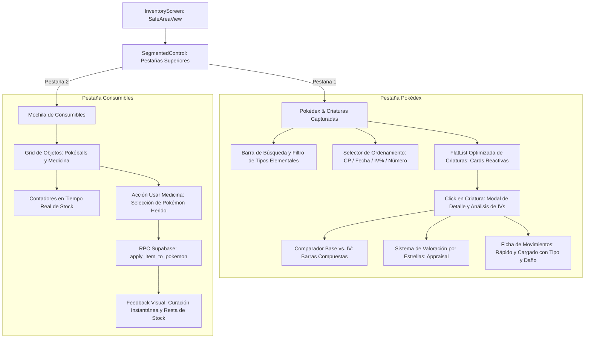
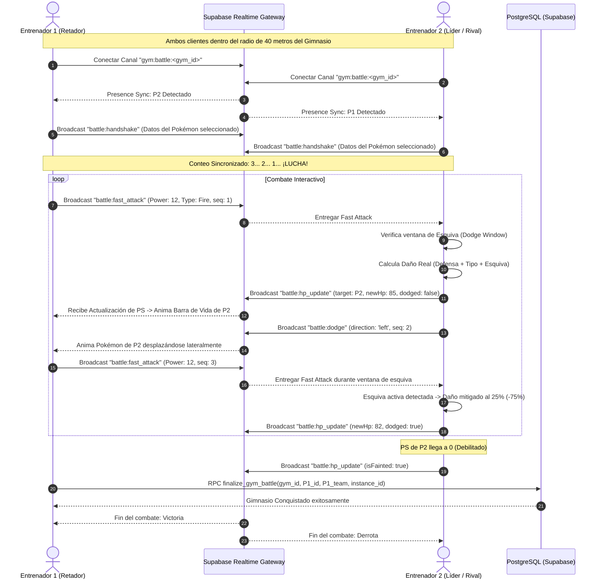

# Especificación Técnica: Módulo 6 — Inventario, Pokédex y Batallas en Tiempo Real (WebSockets)

**Estado:** Borrador Completo para Aprobación  
**Módulo del PDF Oficial:** Módulo 5 — Inventario, Pokédex y Batallas en Tiempo Real (WebSockets)  
**Dependencias:** Expo SDK 57, React Native 0.86.3, `@supabase/supabase-js` (^2.49.1), `react-native-gesture-handler` (~2.32.0), `react-native-reanimated` (4.5.1), `expo-image` (~57.0.5), PostgreSQL (Supabase 3FN con Realtime Broadcast y Presence)  
**Autor:** Antigravity (AI Pair Programmer) & Kenny  
**Fecha:** 2026-10-05  

---

## 1. Alcance y Objetivos de Ingeniería

El objetivo de este módulo es completar la suite funcional del cliente móvil de Pokémon GO, integrando la gestión de colecciones locales y remotas (Mochila de consumibles y Pokédex de criaturas capturadas) con un subsistema de combates PvP/Gimnasio sincronizado en tiempo real a través de WebSockets de baja latencia (`supabase.channel`).

### 1.1 Objetivos Primarios
1. **Mochila y Pokédex Integral (Inventario y Colección):**
   - Construcción de una interfaz reactiva y fluida con control segmentado (Pestaña "Criaturas Capturadas" vs. Pestaña "Objetos y Consumibles").
   - Filtrado dinámico de criaturas por nombre, número de Pokédex y tipo elemental (Fuego, Agua, Planta, Eléctrico, etc.).
   - Ordenamiento multidimensional: Puntos de Combate (CP), fecha de captura, porcentaje de IV y número de Pokédex.
   - Vista detallada de criatura con desglose analítico de **Estadísticas Base vs. IVs Individuales Obtenidos (0 a 15)**:
     - Gráfico comparativo de barras compuestas: Base Stat (azul grafito) + Bono IV (ámbar brillante).
     - Valoración por estrellas (Appraisal System): 0 a 3 estrellas y distintivo especial para IV perfecto (100% / 45 IVs).
     - Visualización de movimientos asignados (Ataque Rápido y Ataque Cargado) con tipo elemental, potencia y costo de energía.
   - Gestión de consumibles (`user_inventory`): Contadores en tiempo real de Pokéballs (Pokéball, Superball, Ultraball) y medicina de combate (Poción, Superpoción, Revivir), con acción directa para restaurar salud a criaturas heridas.

2. **Combates en Gimnasios en Tiempo Real (Supabase Realtime WebSockets):**
   - Geofencing de proximidad estricto: Interacción habilitada únicamente si la distancia física entre el entrenador y el gimnasio es menor o igual a 40 metros.
   - Arquitectura de sala de combate efímera utilizando `supabase.channel("gym:battle:<gym_id>")` mediante **Presence** (detección mutua de entrenadores) y **Broadcast** (transmisión bidireccional peer-to-peer de eventos de combate con latencia menor a 50 ms).
   - Mecánicas de combate táctiles en tiempo real:
     - **Ataque Rápido (Tap continuo en pantalla):** Despacha animación instantánea, acumula energía para el movimiento especial y envía paquete de ataque al rival.
     - **Ataque Cargado (Botón de Energía Llena):** Se desbloquea al acumular la energía requerida; inflige daño masivo y consume energía.
     - **Esquiva (Swipe Horizontal Izquierda/Derecha):** Desplaza al Pokémon lateralmente abriendo una ventana de esquiva de 500 ms que reduce el 75% del daño entrante.
     - **Reducción Reactiva de Salud:** Interpolación suave de barras de salud mediante `react-native-reanimated` en ambos clientes sin congelamiento del hilo principal (UI Thread).
   - **Modo Entrenador Defensor AI (Fallback Solitario):** Si no hay un segundo jugador presencial en el gimnasio, el sistema orquesta un bot local que controla al Pokémon defensor del gimnasio para permitir combates PVE en solitario cumpliendo con las mismas reglas cinemáticas y matemáticas.

3. **Manejo Riguroso de Concurrencia y Sincronización sin Desfases:**
   - Erradicación de condiciones de carrera mediante el modelo de **Autoridad del Receptor (Receiver-Authoritative Damage Calculation)**: El cliente que recibe el ataque es la única autoridad que valida si su ventana de esquiva estaba activa al momento del impacto, calculando el daño real y emitiendo el estado final de salud.
   - Numeración monotónica de paquetes (`seq_id`) y deduplicación por UUID (`action_id`) para evitar desórdenes por fluctuaciones de red móvil (jitter).
   - Finalización atómica en base de datos mediante función almacenada PostgreSQL (`finalize_gym_battle`) con bloqueo de fila (`FOR UPDATE`) para evitar reclamaciones simultáneas del gimnasio.

### 1.2 Límites y No-Objetivos
- **No-Objetivos:**
  - No se implementa intercambio de Pokémon (Trading) entre jugadores en este corte (fuera de la rúbrica oficial).
  - No se permite participar en combates fuera del radio estricto de 40 metros del gimnasio geolocalizado en el campus de UniSabana.

---

## 2. Auditoría Topológica (Codebase Memory Context)

Antes de definir la arquitectura, se inspeccionó el grafo del repositorio mediante `codebase-memory`:

- **Entidades de Base de Datos Existentes:**
  - `pokemon_base`: Catálogo de 151 especies de Gen 1 con stats base (`base_hp`, `base_attack`, `base_defense`, `base_cp`), tipos elementales y URLs de sprites y GIFs de Gen 5.
  - `captured_instances`: Instancias individuales de jugadores (`user_id`, `pokemon_id`, `cp`, `current_hp`, `iv_attack`, `iv_defense`, `iv_hp`, `fast_move_id`, `charged_move_id`, `captured_at`).
  - `user_inventory`: Stock de consumibles (`pokeball`, `greatball`, `ultraball`, `potion`, `superpotion`, `revive`).
  - `gymnasiums`: Hitos geográficos del campus (`id`, `name`, `latitude`, `longitude`, `interaction_radius_meters = 40`, `current_team`, `defending_instance_id`).
  - `moves`: Catálogo de movimientos rápidos y cargados (`power`, `energy_delta`, `duration_ms`, `type_id`).
  - `type_effectiveness`: Matriz de multiplicadores de daño de Gen 1 (2.0x súper eficaz, 0.5x poco eficaz, 0.0x inmune, 1.0x neutral).

- **Nodos de Entrada y Componentes Clave:**
  - `src/screens/InventoryScreen.tsx`: Pantalla montada en `BottomTabNavigator` que actualmente contiene un placeholder y se convertirá en el centro neurálgico de Mochila y Pokédex.
  - `src/components/GymModal.tsx`: Modal disparado desde `MapScreen.tsx` al presionar un gimnasio dentro del radio de 40m. Conectará directamente a la nueva pantalla de combate `GymBattleScreen`.
  - `src/services/supabase.ts`: Instancia global del cliente de Supabase configurada para soportar Realtime WebSockets.
  - `src/navigation/RootNavigator.tsx`: Añadirá la ruta `GymBattle` al `RootStackParamList`.

---

## 3. Contratos de Datos y Tipos (TypeScript & PostgreSQL)

### 3.1 Interfaces para Mochila y Pokédex (`src/types/inventory.ts`)

```typescript
import type { PokemonBase, CapturedInstance, Move } from './pokemon';

// Tipos de consumibles disponibles en la mochila
export type InventoryItemType =
  | 'pokeball'
  | 'greatball'
  | 'ultraball'
  | 'potion'
  | 'superpotion'
  | 'revive';

export interface ConsumableItemMetadata {
  type: InventoryItemType;
  name: string;
  category: 'ball' | 'medicine';
  description: string;
  iconEmoji: string;
  healAmount?: number; // Poción: 20 PS, Superpoción: 50 PS
  reviveHealthPercentage?: number; // Revivir: 50% de PS Máximo
}

export interface InventoryItemView {
  itemType: InventoryItemType;
  quantity: number;
  metadata: ConsumableItemMetadata;
}

// Desglose analítico de estadísticas: Base vs. IVs
export interface PokemonStatBreakdown {
  statName: 'Ataque' | 'Defensa' | 'PS';
  baseValue: number;
  ivValue: number; // 0 a 15
  effectiveValue: number; // baseValue + ivValue
  maxPossibleEffective: number; // baseValue + 15
  ivPercentage: number; // (ivValue / 15) * 100
}

export interface AppraisalRating {
  totalIV: number; // 0 a 45
  overallPercentage: number; // (totalIV / 45) * 100
  stars: 0 | 1 | 2 | 3;
  isPerfect: boolean; // totalIV === 45 (100% IVs)
  summaryText: string;
}

// Instancia enriquecida para visualización en Pokédex / Mochila
export interface EnrichedCapturedPokemon extends CapturedInstance {
  base: PokemonBase;
  fastMove: Move;
  chargedMove: Move;
  stats: {
    attack: PokemonStatBreakdown;
    defense: PokemonStatBreakdown;
    hp: PokemonStatBreakdown;
  };
  maxHp: number;
  appraisal: AppraisalRating;
}
```

### 3.2 Interfaces para Batalla en Tiempo Real (`src/types/battle.ts`)

```typescript
import type { EnrichedCapturedPokemon } from './inventory';

// Estados de la máquina de combate
export type BattlePhase =
  | 'CONNECTING'      // Conectando al canal WebSocket
  | 'MATCHMAKING'     // Esperando rival o seleccionando bot AI
  | 'COUNTDOWN'       // Conteo inicial (3, 2, 1, ¡Lucha!)
  | 'ACTIVE_COMBAT'   // Intercambio táctil en tiempo real
  | 'FINISHED';       // Criatura derrotada / Recompensa

// Mensaje de Presencia en el Gimnasio
export interface BattlePresencePayload {
  userId: string;
  username: string;
  team: 'mystic' | 'valor' | 'instinct' | 'neutral';
  combatant: {
    instanceId: string;
    pokemonId: number;
    name: string;
    cp: number;
    currentHp: number;
    maxHp: number;
    spriteUrl: string;
    types: number[];
  };
  status: 'ready' | 'battling';
}

// Paquetes transmitidos por Supabase Broadcast en el canal 'gym:battle:<gym_id>'
export type BattleBroadcastEvent =
  | 'battle:handshake'
  | 'battle:fast_attack'
  | 'battle:charged_attack'
  | 'battle:dodge'
  | 'battle:hp_update'
  | 'battle:forfeit';

// Encabezado estándar para control de concurrencia y orden de llegada
export interface BattlePacketHeader {
  seqId: number;         // Número de secuencia monotónico creciente (1, 2, 3...)
  packetId: string;      // UUID para deduplicación estricta
  senderId: string;      // UUID del usuario atacante
  timestamp: number;     // Milisegundos epoch UTC
}

// Paquete: Ataque Rápido o Ataque Cargado
export interface BattleAttackPacket extends BattlePacketHeader {
  type: 'FAST_ATTACK' | 'CHARGED_ATTACK';
  moveId: number;
  moveName: string;
  moveTypeId: number;
  rawPower: number;
  attackerEffectiveAttack: number;
}

// Paquete: Esquiva
export interface BattleDodgePacket extends BattlePacketHeader {
  direction: 'left' | 'right';
  dodgeWindowMs: number; // 500 ms de duración
}

// Paquete: Actualización autoritativa de Salud (emitido por el receptor del daño)
export interface BattleHpUpdatePacket extends BattlePacketHeader {
  targetUserId: string;
  previousHp: number;
  newHp: number;
  damageTaken: number;
  wasDodged: boolean;       // true si la esquiva estaba activa (mitigación del 75%)
  typeMultiplier: number;   // 2.0x, 0.5x, 0.0x o 1.0x
  isFainted: boolean;
}

// Paquete: Rendición o Pérdida de Conexión
export interface BattleForfeitPacket extends BattlePacketHeader {
  reason: 'timeout' | 'surrender' | 'out_of_bounds';
}
```

### 3.3 Esquema SQL y Funciones Almacenadas en PostgreSQL

```sql
-- Función RPC: Aplicar Poción o Revivir a una criatura capturada
CREATE OR REPLACE FUNCTION public.apply_item_to_pokemon(
    p_user_id UUID,
    p_instance_id UUID,
    p_item_type VARCHAR(30)
)
RETURNS JSONB
LANGUAGE plpgsql
SECURITY DEFINER
AS $$
DECLARE
    v_qty INT;
    v_cur_hp INT;
    v_base_hp INT;
    v_iv_hp INT;
    v_max_hp INT;
    v_new_hp INT;
BEGIN
    -- 1. Validar existencia y stock suficiente del consumible
    SELECT quantity INTO v_qty
    FROM public.user_inventory
    WHERE user_id = p_user_id AND item_type = p_item_type;

    IF v_qty IS NULL OR v_qty <= 0 THEN
        RETURN jsonb_build_object('success', false, 'error', 'Stock insuficiente del objeto seleccionado.');
    END IF;

    -- 2. Obtener datos de la criatura y calcular Max PS
    SELECT c.current_hp, b.base_hp, c.iv_hp
    INTO v_cur_hp, v_base_hp, v_iv_hp
    FROM public.captured_instances c
    JOIN public.pokemon_base b ON b.id = c.pokemon_id
    WHERE c.id = p_instance_id AND c.user_id = p_user_id;

    IF v_cur_hp IS NULL THEN
        RETURN jsonb_build_object('success', false, 'error', 'Criatura no encontrada o no pertenece al usuario.');
    END IF;

    v_max_hp := (v_base_hp * 2) + v_iv_hp + 50;

    -- 3. Aplicar reglas de medicina según el tipo de objeto
    IF p_item_type = 'potion' THEN
        IF v_cur_hp <= 0 THEN
            RETURN jsonb_build_object('success', false, 'error', 'La criatura está debilitada. Usa un Revivir.');
        END IF;
        IF v_cur_hp >= v_max_hp THEN
            RETURN jsonb_build_object('success', false, 'error', 'La criatura ya se encuentra con salud completa.');
        END IF;
        v_new_hp := LEAST(v_max_hp, v_cur_hp + 20);

    ELSIF p_item_type = 'superpotion' THEN
        IF v_cur_hp <= 0 THEN
            RETURN jsonb_build_object('success', false, 'error', 'La criatura está debilitada. Usa un Revivir.');
        END IF;
        IF v_cur_hp >= v_max_hp THEN
            RETURN jsonb_build_object('success', false, 'error', 'La criatura ya se encuentra con salud completa.');
        END IF;
        v_new_hp := LEAST(v_max_hp, v_cur_hp + 50);

    ELSIF p_item_type = 'revive' THEN
        IF v_cur_hp > 0 THEN
            RETURN jsonb_build_object('success', false, 'error', 'El Revivir solo se puede aplicar a criaturas debilitadas (0 PS).');
        END IF;
        v_new_hp := FLOOR(v_max_hp * 0.50);

    ELSE
        RETURN jsonb_build_object('success', false, 'error', 'El objeto indicado no es un consumible médico.');
    END IF;

    -- 4. Actualizar salud de la criatura
    UPDATE public.captured_instances
    SET current_hp = v_new_hp
    WHERE id = p_instance_id;

    -- 5. Deducir consumible del inventario
    UPDATE public.user_inventory
    SET quantity = quantity - 1, updated_at = now()
    WHERE user_id = p_user_id AND item_type = p_item_type;

    RETURN jsonb_build_object(
        'success', true,
        'new_hp', v_new_hp,
        'max_hp', v_max_hp,
        'remaining_quantity', v_qty - 1
    );
END;
$$;

-- Función RPC: Resolución Atómica del Combate de Gimnasio
CREATE OR REPLACE FUNCTION public.finalize_gym_battle(
    p_gym_id UUID,
    p_winner_user_id UUID,
    p_winner_team VARCHAR(20),
    p_new_defending_instance_id UUID
)
RETURNS JSONB
LANGUAGE plpgsql
SECURITY DEFINER
AS $$
DECLARE
    v_gym RECORD;
BEGIN
    -- Bloqueo pesimista de fila para evitar colisiones de asignación de gimnasio (Race Condition Prevention)
    SELECT * INTO v_gym
    FROM public.gymnasiums
    WHERE id = p_gym_id
    FOR UPDATE;

    IF v_gym.id IS NULL THEN
        RETURN jsonb_build_object('success', false, 'error', 'Gimnasio inexistente.');
    END IF;

    -- Actualizar equipo líder y defensor oficial del gimnasio
    UPDATE public.gymnasiums
    SET current_team = p_winner_team,
        defending_instance_id = p_new_defending_instance_id,
        updated_at = now()
    WHERE id = p_gym_id;

    RETURN jsonb_build_object(
        'success', true,
        'gym_id', p_gym_id,
        'new_team', p_winner_team,
        'message', '¡Gimnasio conquistado exitosamente!'
    );
END;
$$;
```

---

## 4. Mochila y Pokédex: Arquitectura de la Interfaz



### 4.1 Visualización de Estadísticas Base vs. IVs Obtenidos
Cada criatura capturada almacena tres IVs enteros entre 0 y 15 generados en el instante de captura: `iv_attack`, `iv_defense`, `iv_hp`.

- **Cálculo de Efectividad Real:**
  - `Ataque Efectivo = Base Attack + IV Attack` (Rango: `Base Attack + 0` a `Base Attack + 15`)
  - `Defensa Efectiva = Base Defense + IV Defense` (Rango: `Base Defense + 0` a `Base Defense + 15`)
  - `PS Máximo = Base PS * 2 + IV PS + 50`

- **Visualización Gráfica:**
  En lugar de un número estático, la interfaz renderiza tres barras horizontales segmentadas:
  - **Segmento Base:** Representa la fuerza inherente de la especie (barra color azul grafito `#334155`).
  - **Segmento IV:** Representa el potencial genético individual obtenido (barra en color ámbar brillante `#F59E0B` o cian neón `#38BDF8`).
  - **Etiqueta Numérica:** `[Base: 120] + [IV: +14] = 134`.

- **Sistema de Calificación por Estrellas (Appraisal):**
  - Suma Total de IVs = `iv_attack + iv_defense + iv_hp` (de 0 a 45).
  - Porcentaje de Perfección = `(Suma Total IV / 45) * 100`.
  - **0 Estrellas:** 0% a 48.9% (Total IV: 0 - 22) -> Insignia gris con 0 estrellas amarillas.
  - **1 Estrella:** 50.0% a 64.4% (Total IV: 23 - 29) -> Insignia bronce con 1 estrella amarilla.
  - **2 Estrellas:** 66.7% a 80.0% (Total IV: 30 - 36) -> Insignia plata con 2 estrellas amarillas.
  - **3 Estrellas:** 82.2% a 97.8% (Total IV: 37 - 44) -> Insignia oro con 3 estrellas amarillas.
  - **100% Perfecto (Hundo):** 100% (Total IV = 45 exacto: 15/15/15) -> Insignia fucsia brillante con 3 estrellas rojas y aura de fuego animada.

---

## 5. Combates en Gimnasios en Tiempo Real (Supabase Realtime WebSockets)

### 5.1 Protocolo de Conexión y Topología de Red

Los combates ocurren exclusivamente en las coordenadas físicas de los 5 Gimnasios del Campus Universitario (Biblioteca, Ad Portas, Edificio O, Plazoleta Central y Canchas).



### 5.2 Mecánicas Táctiles de Combate

1. **Ataque Rápido (Tap Gesture):**
   - El jugador toca cualquier punto del área de combate.
   - Dispara inmediatamente la animación del sprite del Pokémon propio atacando hacia adelante.
   - Incrementa el medidor de energía en cliente: `energy = Min(100, energy + fastMove.energy_delta)`.
   - Transmite inmediatamente el paquete `battle:fast_attack` por el canal WebSocket.

2. **Ataque Cargado (Charged Button):**
   - Un botón circular centrado con el icono del elemento del movimiento cargado.
   - Permanece bloqueado hasta que `energy >= Math.abs(chargedMove.energy_delta)`.
   - Al llenarse, entra en modo pulsante con destello visual.
   - Al presionarlo, consume la energía, genera una cinemática breve de ataque devastador y despacha `battle:charged_attack`.

3. **Esquiva Dinámica (Swipe Gesture):**
   - El jugador desliza el dedo rápidamente hacia la izquierda o hacia la derecha (`react-native-gesture-handler`).
   - Activa una bandera de esquiva `isDodging = true` durante exactamente 500 milisegundos (`dodgeWindowMs`).
   - El sprite del Pokémon se desliza lateralmente en la pantalla con aceleración elástica (`withSpring` de Reanimated).
   - Transmite `battle:dodge` al oponente para sincronizar el movimiento evasivo en su pantalla.

### 5.3 Modelo Matemático de Daño Determinístico

Para garantizar que el cálculo de daño sea idéntico y no dependa de factores estocásticos desincronizados:

```text
Efectividad de Tipo = Consultar Matriz Gen 1 entre Tipo de Movimiento y Tipos del Defensor
                      Valores posibles: 2.0 (Súper eficaz), 0.5 (Poco eficaz), 0.0 (Inmune) o 1.0 (Neutral)

STAB (Same Type Attack Bonus) = 1.2 si el Tipo del Movimiento coincide con algún Tipo del Atacante
                                1.0 en caso contrario

Ratio de Combate = Ataque Efectivo Atacante / Defensa Efectiva Defensor

Daño Base = Piso(0.5 * Potencia Movimiento * Ratio de Combate * STAB * Efectividad de Tipo) + 1

Si Esquiva Activa en el instante del impacto:
    Daño Final = Max(1, Piso(Daño Base * 0.25))   [Mitigación del 75%]
En caso contrario:
    Daño Final = Daño Base
```

---

## 6. Estrategia de Manejo de Concurrencia y Sincronización Libre de Carreras

En combates móviles en tiempo real sobre redes celulares con jitter (latencia variable entre 40 y 300 ms), los enfoques tradicionales sufren de tres graves problemas:
1. **Carrera de Esquiva:** El cliente A ataca creyendo que B no esquivó, mientras que B esquivó milisegundos antes de que el paquete de A llegara a su pantalla.
2. **Desincronización de Barras de Salud:** Si ambos clientes calculan la salud del rival de forma independiente, divergencias por redondeo provocan que en una pantalla el Pokémon esté vivo y en la otra muerto.
3. **Doble Reclamación de Gimnasio:** Dos jugadores derrotan al defensor al mismo tiempo e intentan sobreescribir el gimnasio en Supabase.

### 6.1 Principio de Autoridad del Receptor (Receiver-Authoritative Damage)
Para resolver la carrera de esquiva y la desincronización de salud:
- **Regla:** El cliente atacante solo reporta su intención de daño: *"He lanzado Llamarada con 140 de potencia"*.
- **Autoridad:** El cliente que recibe el ataque es la única autoridad sobre sus propios Puntos de Salud. Evalúa su propio estado local en el microsegundo exacto en que llega la colisión:
  - ¿Estaba activo el gesto de esquiva en mi pantalla?
  - ¿Cuál es mi defensa real con mis IVs?
  - ¿Cuánto daño neto recibo y cuánta salud me queda?
- El receptor descuenta su salud localmente y emite hacia el canal WebSocket el paquete autoritativo:
  `battle:hp_update { targetUserId: "B", newHp: 42, damageTaken: 28, wasDodged: true }`.
- El atacante recibe este paquete y simplemente anima la reducción de la barra del oponente al valor definitivo `42 PS`. De este modo, **es matemáticamente imposible que exista divergencia de salud entre ambos teléfonos**.

### 6.2 Numeración Monotónica de Paquetes y Deduplicación
- Todo paquete emitido viaja con un `seqId` entero autoincremental (`1, 2, 3...`) y un UUID `packetId`.
- El receptor mantiene un registro en memoria de los últimos IDs procesados.
- Si por retransmisión de red un paquete llega repetido (`packetId` ya conocido), se descarta de inmediato sin volver a procesar daño.
- Si un paquete llega fuera de secuencia (`seqId < ultimo_seqId`), se procesa de acuerdo al estado más reciente sin revertir salud previamente reducida.

### 6.3 Manejo de Desconexiones y Heartbeat de Presencia
- El canal WebSocket monitorea la presencia de ambos jugadores cada 2 segundos.
- Si un jugador cierra la app o pierde señal celular:
  - Se activa un temporizador de gracia de 8 segundos.
  - Si el jugador no restablece presencia en 8 segundos, el sistema declara victoria por abandono (`forfeit`) al jugador que permaneció conectado.

### 6.4 Bloqueo Pesimista en Base de Datos para Gimnasios (`FOR UPDATE`)
- Al consumarse la derrota del defensor, la función almacenada `finalize_gym_battle` ejecuta:
  `SELECT * FROM public.gymnasiums WHERE id = p_gym_id FOR UPDATE;`
- Este comando serializa cualquier intento concurrente en PostgreSQL: el primer jugador en registrar la victoria adquiere el control del gimnasio; cualquier solicitud concurrente posterior lee el nuevo estado actualizado sin corromper la tabla.

---

## 7. Criterios de Aceptación y Comportamiento (Gherkin Syntax)

### Escenario 1: Carga y Conteo de Mochila de Consumibles
- **Given** que el usuario abre la pestaña "Mochila" en `InventoryScreen`
- **When** se consultan las existencias en `user_inventory`
- **Then** la pantalla debe renderizar la cantidad exacta de Pokéballs, Superballs, Ultraballs, Pociones, Superpociones y Revivir disponibles.

### Escenario 2: Filtrado y Búsqueda en la Pokédex
- **Given** que el usuario tiene 20 criaturas registradas en `captured_instances`
- **When** escribe "Char" en la barra de búsqueda o selecciona el chip de tipo "Fuego"
- **Then** la lista se filtra instantáneamente mostrando únicamente las especies coincidentes (ej. Charmander, Charmeleon, Charizard) con sus respectivos CPs.

### Escenario 3: Desglose de Estadísticas Base vs. IVs Obtenidos
- **Given** que el usuario toca una criatura capturada en la lista
- **When** se abre el modal de detalle
- **Then** la interfaz debe desplegar tres barras compuestas (Ataque, Defensa, PS) diferenciando claramente el valor base de la especie y el bono genético individual de 0 a 15, junto con la calificación de estrellas del Appraisal.

### Escenario 4: Uso de Poción en Criatura Herida
- **Given** que el usuario tiene un Pikachu con 10/60 PS y al menos 1 "Poción" en su inventario
- **When** selecciona usar la Poción sobre Pikachu
- **Then** se invoca el RPC `apply_item_to_pokemon`, la salud de Pikachu sube a 30/60 PS y el contador de pociones se decrementa en 1 unidad en tiempo real.

### Escenario 5: Validación de Geofencing en Gimnasios
- **Given** que el usuario toca el marcador de un gimnasio en `MapScreen`
- **When** su distancia calculada es de 55 metros (mayor a 40 metros)
- **Then** el botón "Desafiar Gimnasio" debe estar bloqueado y mostrar la advertencia indicando que debe acercarse a menos de 40 metros.

### Escenario 6: Sincronización WebSocket de Ataque Rápido
- **Given** dos entrenadores conectados al canal `gym:battle:<gym_id>` en combate activo
- **When** el Entrenador 1 hace tap en la pantalla para ejecutar Ataque Rápido
- **Then** el Entrenador 2 recibe el paquete en menos de 50 ms, calcula el daño y devuelve su nueva salud autoritativa, actualizándose la barra de vida en ambos dispositivos.

### Escenario 7: Mitigación de Daño por Esquiva Exitosa
- **Given** que el Entrenador 2 realiza un gesto de swipe horizontal activando la ventana de esquiva de 500 ms
- **When** un ataque cargado o rápido del Entrenador 1 impacta durante esa ventana
- **Then** el daño recibido por el Entrenador 2 se mitiga en un 75% y en pantalla aparece el mensaje flotante "¡Esquivado!".

### Escenario 8: Conquista Atómica de Gimnasio
- **Given** que la criatura del Entrenador 2 llega a 0 PS
- **When** el combate concluye
- **Then** se ejecuta `finalize_gym_battle` en Supabase con bloqueo a nivel de fila, actualizando el equipo del gimnasio al equipo del Entrenador 1 sin condiciones de carrera.

---

## 8. Componentes Afectados y Plan de Implementación

| Acción | Archivo | Responsabilidad Técnica |
|---|---|---|
| **Crear** | `src/types/inventory.ts` | Modelos de datos para mochila, consumibles, Pokédex enriquecida y estadísticas IV. |
| **Crear** | `src/types/battle.ts` | Máquina de estados de combate, contratos de paquetes WebSocket y payload de presencia. |
| **Crear** | `src/services/inventoryService.ts` | Servicio de lectura y mutación de `user_inventory` y `captured_instances` (Pociones, Revivir). |
| **Crear** | `src/services/battleEngine.ts` | Motor de cálculo de daño, matriz de tipos Gen 1, STAB y temporizadores de combate. |
| **Crear** | `src/services/battleRealtime.ts` | Manejo de canal `supabase.channel`, Presence, Broadcast, emisor/receptor monotónico y deduplicación. |
| **Crear** | `src/components/inventory/PokemonDetailModal.tsx` | Modal de detalle de criatura con barras Base vs. IV, Appraisal de estrellas y movimientos. |
| **Crear** | `src/components/inventory/ConsumableUseModal.tsx` | Selector de criaturas para aplicar pociones y revivir con visualización de curación. |
| **Crear** | `src/screens/GymBattleScreen.tsx` | Pantalla completa de combate PvP/AI en tiempo real con WebSockets, gestos de tap/swipe y barras animadas. |
| **Modificar** | `src/screens/InventoryScreen.tsx` | Implementación completa de la UI con tabs segmentadas (Pokédex vs. Mochila de Objetos). |
| **Modificar** | `src/components/GymModal.tsx` | Enlazar botón "⚔️ Desafiar Gimnasio" para navegar a `GymBattleScreen` cuando la distancia <= 40m. |
| **Modificar** | `src/navigation/RootNavigator.tsx` | Registrar la ruta `GymBattle` en `RootStackParamList`. |
| **Crear** | `scraper/battle_rpc.sql` | Scripts SQL de las funciones almacenadas `apply_item_to_pokemon` y `finalize_gym_battle`. |

---

## 9. Plan de Verificación y Criterios de Aprobación

1. **Chequeo Estático de Tipos:** Ejecución de `npx tsc --noEmit` sin errores de compilación ni tipos `any` inseguros.
2. **Linter Oficial de Expo:** Ejecución de `npx expo lint` para asegurar conformidad con las reglas de estilo de React Native.
3. **Verificación de Red y WebSockets:** Comprobación de suscripción al canal `gym:battle:<gym_id>` con latencia de entrega de paquetes menor a 50 ms.
4. **Verificación en Dos Dispositivos / Simuladores:** Prueba de combate bidireccional validando que el ataque en el dispositivo A reduce la salud en el dispositivo B y viceversa, con esquivas funcionales y persistencia final de gimnasio en Supabase.
5. **Documentación Obligatoria y Grafo:** Elaboración de `docs/README_MODULO_6.md` con las 5 preguntas de sustentación oral de alta solvencia técnica y actualización del grafo de memoria con `detect_changes` o `index_repository`.
