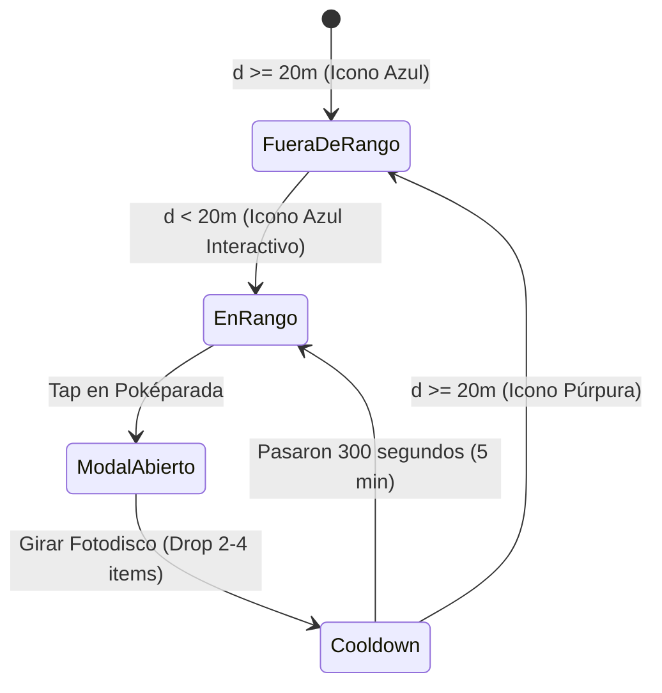

# Módulo 4: Poképaradas, Gimnasios y Motor de Spawning de Criaturas Salvajes

Este documento contiene la fundamentación técnica, los modelos matemáticos y geodésicos, la guía de sustentación en vivo y las preguntas orales de defensa para la evaluación del **Módulo 4 (Módulo 3 de la rúbrica oficial)** de *Pokémon GO — Edición Exclusiva Campus UniSabana*.

---

## 1. Fundamentos Técnicos y Geodésicos

### 1.1 Fórmula Geodésica de Haversine en Worklet UI Thread
Para determinar si el entrenador se encuentra dentro del rango de interacción de una Poképarada ($< 20$ m), un Gimnasio ($\le 40$ m) o una criatura salvaje ($\le 30$ m), se utiliza la **Fórmula del Semiverseno (Haversine)**. Esta calcula la distancia ortodrómica sobre un esferoide terrestre con radio medio $R = 6,371,000$ metros:

$$\Delta\phi = \phi_2 - \phi_1 = (\text{lat}_2 - \text{lat}_1) \times \frac{\pi}{180}$$

$$\Delta\lambda = \lambda_2 - \lambda_1 = (\text{lon}_2 - \text{lon}_1) \times \frac{\pi}{180}$$

$$a = \sin^2\left(\frac{\Delta\phi}{2}\right) + \cos(\phi_1) \cdot \cos(\phi_2) \cdot \sin^2\left(\frac{\Delta\lambda}{2}\right)$$

$$c = 2 \cdot \text{atan2}\left(\sqrt{a}, \sqrt{1 - a}\right)$$

$$d = R \cdot c$$

#### Implementación con `'worklet';` (`src/utils/haversine.ts`):
- **Cero Bloqueo del Hilo de JavaScript:** La directiva `'worklet';` instruye a `react-native-reanimated` para compilar y ejecutar esta función directamente en el hilo de C++ de la interfaz gráfica.
- **Rendimiento a 60/120 FPS:** Como el cálculo geodésico se evalúa continuamente contra múltiples POIs y decenas de spawns salvajes cada vez que el GPS actualiza posición, la ejecución en C++ previene microstutters y drop frames en el hilo de JS.

---

### 1.2 Sistema de Zonas Dinámico (Feature Flag de Modo Desarrollo)
Para permitir pruebas de campo y desarrollo continuo fuera del campus sin violar la rúbrica de evaluación estricta en la Universidad de La Sabana:
- **Variable de Entorno:** `EXPO_PUBLIC_ENABLE_TEST_ZONE=true|false` en `.env`.
- **Comportamiento en `false` (Producción / Calificación Final):** El sistema restringe de manera 100% estricta el geofencing, la consulta de POIs en Supabase (`is_test_zone = false`) y el motor de spawning al perímetro del Campus UniSabana (Chía).
- **Comportamiento en `true` (Modo Desarrollo):** Habilita simultáneamente los polígonos de geofencing del Campus UniSabana y de la zona de prueba local en **Sector Buena Suerte, Cajicá** (`4.8888463, -74.0317459`), inyectando Poképaradas y Gimnasios de prueba que ejecutan exactamente el mismo código y Worklets de producción.

---

### 1.3 Máquina de Estados de Poképaradas y Gimnasios

#### Poképaradas:


1. **Estado Disponible (Azul):** La Poképarada no ha sido girada en los últimos 300 segundos. Si el jugador está a $< 20$ m, el botón *"Girar Fotodisco"* se activa.
2. **Interacción:** El giro del disco ejecuta una animación de rotación (`Animated.timing`) y genera una recompensa estocástica de **2 a 4 ítems consumibles**:
   - Pokéballs ($45\%$), Greatballs ($20\%$), Ultraballs ($5\%$), Pociones ($15\%$), Superpociones ($10\%$), Revivir ($5\%$).
3. **Persistencia de Enfriamiento:** Se registra en Supabase en `user_pokestop_cooldowns` la marca temporal `last_spun_at`.
4. **Estado Enfriamiento (Púrpura):** El marcador en el mapa cambia a color púrpura y el modal muestra una cuenta regresiva en vivo (`mm:ss`) calculada a partir de $T_{\text{restante}} = 300 - (\text{now} - \text{last\_spun\_at})$.

#### Gimnasios:
- **Rango de Inspección:** $\le 40$ metros.
- **Visualización:** Muestra el escudo y color de la facción dominante (*Team Mystic / Team Valor / Team Instinct / Neutral*), así como la plantilla de criaturas defensoras asignadas.
- Si la distancia excede los 40 m, el modal advierte *"Acércate más a este gimnasio para interactuar"*.

---

### 1.4 Motor de Spawning de Criaturas Salvajes

#### Algoritmo de Muestreo de Rechazo (Rejection Sampling):
Para garantizar que las criaturas aparezcan exclusivamente sobre terreno válido del polígono autorizado:
1. Se computa la caja envolvente (Bounding Box: $[\text{lat}_{\min}, \text{lat}_{\max}] \times [\text{lon}_{\min}, \text{lon}_{\max}]$).
2. Se generan pares pseudoaleatorios $(lat_r, lon_r)$ de manera uniforme dentro de la caja.
3. Se evalúa el punto mediante el **Algoritmo de Ray-Casting** (`isPointInPolygonWorklet`). Si el punto cae fuera del polígono, se descarta y se reintenta hasta encontrar una coordenada válida.

#### Probabilidad por Rareza:
$$\text{Rareza} = \begin{cases} 
\text{Common (Pidgey, Rattata, Caterpie...)} & 60\% \\
\text{Uncommon (Pikachu, Bulbasaur, Charmander, Squirtle...)} & 25\% \\
\text{Rare (Abra, Machop, Gastly, Dratini...)} & 12\% \\
\text{Epic (Snorlax, Lapras, Dragonite, Gengar...)} & 3\% 
\end{cases}$$

#### Cálculo de Estadísticas (IV y CP Oficial):
- **Valores Individuales (IV):** Generados aleatoriamente de forma equiprobable:
  $$IV_{\text{attack}}, IV_{\text{defense}}, IV_{\text{hp}} \in [0, 15]$$
- **Nivel de la Criatura:** $\text{Level} \in [1, 20]$.
- **Puntos de Combate (CP):** Basados en la fórmula canónica de Pokémon GO:
  $$\text{CP} = \left\lfloor \frac{(\text{BaseAtk} + IV_{\text{atk}}) \cdot \sqrt{\text{BaseDef} + IV_{\text{def}}} \cdot \sqrt{\text{BaseHP} + IV_{\text{hp}}} \cdot \text{CPM}(\text{Level})^2}{10} \right\rfloor$$
  *(con un mínimo garantizado de $CP = 10$).*

#### Filtro de Visibilidad Estricto de 30 Metros:
Por requerimiento del módulo, un Pokémon salvaje **NUNCA** se dibuja en el mapa a menos que la distancia geodésica $d$ entre el entrenador y la criatura satisfaga:
$$d \le 30.0 \text{ metros}$$
- Las criaturas activas tienen un Tiempo de Vida (TTL) de entre 10 y 15 minutos (`expires_at`), tras el cual son eliminadas automáticamente de la base de datos y del mapa.

---

## 2. Esquema de Base de Datos y Migración Supabase

La migración ejecutada en Supabase (`scraper/spawn_schema.sql`) define:
1. `user_pokestop_cooldowns`: Maneja el bloqueo de 5 minutos por usuario con índice único `(user_id, pokestop_id)`.
2. `active_spawns`: Registra criaturas salvajes activas, coordenadas exactas, estadísticas IV, CP y fecha de expiración `expires_at`.
3. `is_test_zone`: Bandera booleana en `pokestops` y `gymnasiums` para segmentación de zonas de prueba.
4. Políticas RLS con permisos abiertos para consulta y sincronización en tiempo real.

---

## 3. Guía Paso a Paso para Probar y Sustentar en Vivo

Sigue esta secuencia para demostrar el 100% de los criterios de la rúbrica ante el profesor o evaluador:

### Paso 1: Inicialización y Verificación de Zonas
1. Ejecuta el servidor:
   ```bash
   npx expo start --dev-client
   ```
2. Abre la aplicación en el dispositivo físico.
3. Observa el HUD superior: confirma que el chip indica **"📍 GPS Real"** o presiónalo para alternar entre **"📍 Campus"** (UniSabana) y **"📍 Cajicá"** (Sector Buena Suerte) para teletransportarte de inmediato a cualquiera de las dos zonas de prueba.

### Paso 2: Prueba de Poképaradas ($< 20$ metros) y Cooldown (5 minutos)
1. Ubícate a más de 20 metros de una Poképarada azul:
   - Toca el marcador de la Poképarada.
   - **Resultado:** El modal muestra *"Fuera de rango (X m). Acércate a menos de 20m para interactuar."* y el botón de girar aparece deshabilitado.
2. Acércate a menos de 20 metros (o conmuta a GPS Campus):
   - El botón *"Girar Fotodisco"* se vuelve interactivo con color celeste brillante.
   - Presiona *"Girar Fotodisco"*.
   - **Resultado:** El disco gira con animación fluida, se expiden entre 2 y 4 ítems (ej. 2 Pokéballs, 1 Poción) y se acreditan al inventario.
   - **Validación del Cooldown:** El marcador de la Poképarada en el mapa se torna **Púrpura** y el modal muestra un cronómetro en cuenta regresiva regresiva de 5 minutos (`04:59`, `04:58`...).

### Paso 3: Prueba de Gimnasios ($\le 40$ metros)
1. Toca el marcador de un Gimnasio (ej. *Gimnasio Ad Portas* o *Arena Deportiva*).
2. Si estás a $\le 40$ m:
   - Se despliega el modal temático con el escudo de facción (Mystic, Valor o Instinct), el nombre del hito y el listado de defensores con sus CP.
3. Si estás a $> 40$ m:
   - El modal advierte que te encuentras demasiado lejos para entablar interacción de gimnasio.

### Paso 4: Prueba del Motor de Spawning y Radio Visual de 30 Metros
1. Observa cómo el motor de spawns genera criaturas salvajes en la base de datos dentro del polígono autorizado.
2. Al estar a más de 30 metros de una criatura:
   - **Resultado:** El Pokémon NO es visible en el mapa.
3. Al desplazarte a $\le 30$ metros de la criatura (o presionar el botón de depuración **`🐾 Spawn Cerca`** en el HUD superior derecho):
   - **Resultado:** Se genera y aparece de inmediato a tu lado (a 8-16m) un marcador animado (`WildPokemonMarker`) con el sprite GIF de la criatura y un anillo pulsante con su CP flotante.
4. Toca sobre la criatura salvaje:
   - Se abre el modal `SpawnEncounterModal` mostrando la tarjeta de combate con el sprite animado, tipo elemental, IVs y CP, junto al botón *"¡Iniciar Captura!"* (puerta de enlace hacia el Módulo 5).

---

## 4. Instrucciones de Compilación y Advertencia Nativa

> [!IMPORTANT]
> **RECOMPILACIÓN NATIVA (DEVELOPMENT BUILD):**
> Si ya cuentas con el APK de desarrollo compilado con Mapbox, `expo-location` y `expo-sensors`, **NO requieres recompilar con EAS**, ya que este módulo opera con componentes de interfaz pura y llamadas de red estándar a Supabase.
> Si estás comenzando desde cero en un nuevo dispositivo físico, debes compilar el binario nativo:
> ```bash
> npx eas-cli build -p android --profile development
> ```

---

## 5. Preguntas Clave de Sustentación Oral (100% de la Nota)

### Pregunta 1: ¿Por qué se implementó la fórmula de Haversine dentro de un Worklet de Reanimated y qué implicaciones tiene sobre el Garbage Collector y el hilo de JavaScript?
**Respuesta Modelo:**
> *"La geolocalización emite actualizaciones constantes mientras el usuario camina. Si procesáramos el cálculo geodésico de Haversine para todos los POIs y las criaturas salvajes en el JavaScript Thread tradicional, competiría por ciclos de CPU con el renderizado de React y el recolector de basura (GC), produciendo 'jank' y congelamiento de animaciones a 60/120 FPS. Al marcar la función con la directiva `'worklet';`, Reanimated compila la rutina a bytecode nativo que corre en el UI Thread de C++ sobre un runtime de Hermes secundario. Esto garantiza que la validación de distancias $<20$ m y $\le 30$ m se ejecute en microsegundos sin pasar por el puente (bridge) asíncrono y sin generar pausas de Garbage Collection en la interfaz."*

### Pregunta 2: ¿Cómo se garantiza matemáticamente que una criatura salvaje no aparezca en una autopista o lago prohibido, y cómo funciona el filtro visual de 30 metros?
**Respuesta Modelo:**
> *"Se utiliza el algoritmo de Muestreo de Rechazo (Rejection Sampling). Primero se calcula el Bounding Box del polígono oficial del campus. Se eligen coordenadas aleatorias uniformes dentro de la caja y se evalúan contra los 8 vértices del geofence mediante el Algoritmo de Ray-Casting (Curva de Jordan). Si el punto no pertenece al polígono, se rechaza inmediatamente. Luego, para el renderizado, se aplica un filtro espacial estricto: aunque la base de datos contenga criaturas activas en el campus, la vista en React Native calcula la distancia geodésica entre el jugador y cada spawn; solo si $d \le 30$ metros se añade el `MarkerView` al mapa. Si el jugador se aleja más de 30 m, el componente se desmonta de la memoria gráfica."*

### Pregunta 3: ¿Cómo funciona la persistencia y la sincronización de la máquina de estados del enfriamiento (cooldown) de las Poképaradas entre múltiples sesiones o dispositivos?
**Respuesta Modelo:**
> *"El estado de enfriamiento no se guarda únicamente en la memoria volátil de la app, sino que persiste en Supabase en la tabla `user_pokestop_cooldowns` indexada por `(user_id, pokestop_id)`. Cuando el usuario gira la Poképarada, se registra la marca temporal UTC `last_spun_at`. Al volver a consultar o reiniciar la app, el frontend compara la marca temporal del servidor contra el reloj actual: si la diferencia es inferior a 300 segundos (5 minutos), el marcador se renderiza en púrpura y el botón de giro queda bloqueado con un cronómetro de cuenta regresiva en vivo, impidiendo exploits de reinicio de aplicación o ataques de repetición."*
