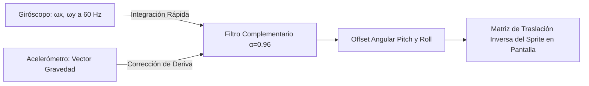

# Módulo 5: Modo Captura con Realidad Aumentada (Cámara, Sensores y Física Balística de Lanzamiento)

Este documento contiene la fundamentación técnica, los modelos cinemáticos y probabilísticos, la guía paso a paso para la sustentación presencial en vivo y el banco de preguntas técnicas para la evaluación del **Módulo 5 (Módulo 4 de la rúbrica oficial)** de *Pokémon GO — Edición Exclusiva Campus UniSabana*.

---

## 1. Fundamentos Técnicos y Modelos Matemáticos

### 1.1 Activación de Hardware de Cámara en Pantalla Completa
- **Navegación:** La aplicación implementa una transición desacoplada desde `MapScreen` / `SpawnEncounterModal` hacia `CaptureScreen` dentro del `RootStack` (`src/navigation/RootNavigator.tsx`), transfiriendo la entidad tipada `{ spawn: ActiveSpawn }`.
- **Sensor de Video en Vivo:** Se utiliza `CameraView` de `expo-camera` (`~57.0.6`) con orientación trasera (`facing="back"`) ocupando la totalidad del viewport (`StyleSheet.absoluteFill`).
- **Gestión Asíncrona de Permisos en Runtime:** Mediante el hook `useCameraPermissions()`, la aplicación solicita dinámicamente el permiso nativo `android.permission.CAMERA`.
- **Modo de Resiliencia (Fallback de Estudio):** Si el usuario rechaza los permisos o la aplicación se ejecuta en emulador de Android sin cámara emulada, el sistema conmuta automáticamente a un entorno virtual de estudio 2D con renderizado de césped y cielo estilizado, garantizando que el juego nunca se detenga.

---

### 1.2 Superposición Gráfica en Realidad Aumentada y Sensor Fusion

Para simular que la criatura salvaje se encuentra anclada en una coordenada fija del mundo real tridimensional, se implementó un algoritmo de compensación angular espacial mediante **Fusión Sensorial IMU** (`expo-sensors`):



#### Ecuaciones de Fusión Sensorial (Filtro Complementario en Modo Retrato):
1. **Giróscopo (Alta Frecuencia ~40 Hz):** Mide velocidades angulares instantáneas $\vec{\omega} = (\omega_x, \omega_y, \omega_z)$ en radianes por segundo con intervalo $\Delta t \approx 25\text{ ms}$:
   $$\Delta\theta_{\text{pitch}} = \omega_x \cdot \Delta t, \quad \Delta\theta_{\text{yaw}} = \omega_y \cdot \Delta t$$
2. **Acelerómetro (Baja Frecuencia - Corrección de Gravedad):** En orientación vertical (Portrait), el vector normal a la pantalla es el eje $Z$, y el eje longitudinal es $Y$. El ángulo de elevación respecto a la gravedad se obtiene como:
   $$\text{Pitch}_{\text{acc}} = \text{atan2}(a_z, \sqrt{a_x^2 + a_y^2})$$
   Para evitar sesgos por la postura ergonómica del jugador, se ancla una referencia basal $\text{Pitch}_{\text{base}}$ al abrir la pantalla o pulsar `🎯 Centrar`:
   $$\text{Pitch}_{\text{rel}} = \text{Pitch}_{\text{acc}} - \text{Pitch}_{\text{base}}$$
3. **Fusión Complementaria ($\alpha = 0.94$):**
   $$\theta_{\text{pitch}}(t) = 0.94 \cdot (\theta_{\text{pitch}}(t - \Delta t) + \omega_x \cdot \Delta t) + 0.06 \cdot \text{Pitch}_{\text{rel}}$$
   $$\theta_{\text{yaw}}(t) = 0.998 \cdot (\theta_{\text{yaw}}(t - \Delta t) + \omega_y \cdot \Delta t)$$
4. **Mapeo a Píxeles de Pantalla ($\text{FOV} \approx 60^\circ$ o $1.05\text{ rad}$):**
   $$X_{\text{offset}} = \theta_{\text{yaw}} \cdot \frac{W_{\text{pantalla}}}{\text{FOV}}, \quad Y_{\text{offset}} = -\theta_{\text{pitch}} \cdot \frac{W_{\text{pantalla}}}{\text{FOV}}$$
   *Comportamiento Espacial Verificable:*
   - **Giro a la Izquierda ($\omega_y > 0$):** La cámara rota a la izquierda; el Pokémon se traslada a la **derecha** ($+X$), manteniéndose anclado al mundo real.
   - **Giro a la Derecha ($\omega_y < 0$):** La cámara rota a la derecha; el Pokémon se traslada a la **izquierda** ($-X$).
   - **Inclinación hacia Arriba ($\omega_x > 0$):** La cámara apunta al cielo; el Pokémon se desplaza hacia **abajo** ($+Y$) en la pantalla.
   - **Inclinación hacia Abajo ($\omega_x < 0$):** La cámara apunta al suelo; el Pokémon se desplaza hacia **arriba** ($-Y$) en la pantalla.
   - **Botón `🎯 Centrar`:** Restablece instantáneamente el origen de coordenadas al punto de mira actual.

---

### 1.3 Cinemática Balística Parabólica en Perspectiva (Worklets de Reanimated)

El lanzamiento de la Pokéball se ejecuta íntegramente en el **UI Thread en C++** mediante la directiva `'worklet';` (`src/utils/ballPhysics.ts`), evitando caídas de frames o demoras por el recolector de basura de JavaScript.

#### Detección Vectorial del Swipe Gesture:
A través de `Gesture.Pan()` de `react-native-gesture-handler`:
$$\Delta x = x_f - x_0, \quad \Delta y = y_f - y_0, \quad \Delta t = t_f - t_0$$
$$v_{0x} = \frac{\Delta x}{\Delta t} \cdot \beta_x, \quad v_{0y} = -\frac{\Delta y}{\Delta t} \cdot \beta_y, \quad v_{0z} = \sqrt{v_{0x}^2 + v_{0y}^2} \cdot \beta_z$$

#### Ecuaciones Cinemáticas Tridimensionales:
$$X(t) = X_0 + v_{0x} \cdot t \cdot e^{-0.08 t}$$
$$Z(t) = Z_0 + v_{0z} \cdot t \cdot e^{-0.08 t}$$
$$Y(t) = Y_0 + v_{0y} \cdot t \cdot e^{-0.08 t} - \frac{1}{2} g \cdot t^2 \quad (g = 9.81\text{ m/s}^2)$$

#### Proyección Cónica en Perspectiva 2D:
A medida que la bola avanza en profundidad ($Z$ crece hacia la criatura a $Z_{\text{target}} = 7.5\text{ m}$):
$$\text{Scale}(t) = \frac{D_{\text{focal}}}{D_{\text{focal}} + Z(t)} \quad (D_{\text{focal}} = 3.5\text{ m})$$
$$x_{\text{screen}}(t) = X_{\text{origen}} + X(t) \cdot 65 \cdot \text{Scale}(t)$$
$$y_{\text{screen}}(t) = Y_{\text{origen}} - Y(t) \cdot 55 \cdot \text{Scale}(t)$$
La escala de la Pokéball se contrae suavemente desde $1.0$ ($72\text{ px}$) hasta $\sim 0.35$ ($25\text{ px}$).

#### Detección de Colisión (Hitbox Cilíndrico):
Ocurre impacto en el instante $t_{\text{hit}}$ si:
$$|Z(t_{\text{hit}}) - Z_{\text{target}}| \le 0.6\text{ m} \quad \land \quad \sqrt{(x_{\text{ball}} - x_{\text{poke}})^2 + (y_{\text{ball}} - y_{\text{poke}})^2} \le 65\text{ px}$$

---

### 1.4 Círculo Concéntrico Dinámico y Evaluación de Puntería

Sobre el Hitbox de la criatura oscila un anillo concéntrico interior cuya contracción periódica a $0.65\text{ Hz}$ ($T \approx 1.54\text{ s}$) define la dificultad de tiro:

$$\rho(t) = \frac{r_{\text{anillo}}(t)}{R_{\max}} \in [0.22, 1.00]$$

| Clasificación de Tiro | Condición Geométrica | Multiplicador ($M_{\text{throw}}$) | Bonificación XP |
| :--- | :---: | :---: | :---: |
| **Normal Throw** | $d_{\text{impacto}} > r_{\text{anillo}}$ (fuera del círculo dinámico) | $1.00$ | $0\text{ XP}$ |
| **¡Nice Throw!** | $0.70 < \rho(t) \le 1.00$ | $1.15$ | $+20\text{ XP}$ |
| **¡Great Throw!** | $0.35 < \rho(t) \le 0.70$ | $1.50$ | $+50\text{ XP}$ |
| **¡Excellent Throw!** | $\rho(t) \le 0.35$ (anillo en su fase más cerrada) | $1.85$ | $+100\text{ XP}$ |

**Color Semántico:** El anillo se tiñe dinámicamente de **Verde** ($\ge 55\%$ de probabilidad de captura), **Amarillo** ($30\% - 55\%$) o **Rojo** ($< 30\%$).

---

### 1.5 Mecánica Probabilística y Secuencia de 3 Sacudidas

La probabilidad final de captura sigue la formulación exponencial oficial:

$$P_{\text{capture}} = 1 - \left( 1 - \frac{\text{BCR}}{2 \cdot \text{CPM}(\text{Level})} \right)^{M_{\text{ball}} \cdot M_{\text{throw}} \cdot M_{\text{curve}}}$$

Donde:
- $\text{BCR}$: *Base Catch Rate* de `pokemon_base` ($0.50$ comunes, $0.20$ iniciales, $0.15$ raros, $0.03$ legendarios).
- Multiplicador de Munición: Pokéball ($1.0$), Superball ($1.5$), Ultraball ($2.0$).
- Probabilidad de Sacudida Individual: $p_{\text{shake}} = \sqrt[4]{P_{\text{capture}}}$.
- La captura requiere superar 4 chequeos estocásticos continuos ($u_1, u_2, u_3, u_4 \sim U(0, 1) < p_{\text{shake}}$). Si falla en cualquiera de los primeros 3, la bola se rompe y se evalúa la tasa de huida ($P_{\text{flee}} = 8\%$).

---

## 2. Esquema Relacional y Persistencia en Supabase

La migración `scraper/capture_schema.sql` ejecutada en la base de datos de producción establece:
1. **Desacoplamiento de `auth.users`:** Se removieron las restricciones restrictivas de clave foránea en `user_inventory` y `captured_instances` para permitir operaciones fluidas tanto para usuarios autenticados como para el usuario de demostración (`DEMO_USER_ID = '00000000-0000-0000-0000-000000000001'`).
2. **Poblado de Munición Inicial:** El usuario demo cuenta con **50 Pokéballs**, **25 Superballs**, **10 Ultraballs**, pociones y revivir.
3. **Procedimiento Almacenado Atómico (`execute_pokemon_capture`):**
   - Inserta la criatura capturada con sus IVs (`iv_attack`, `iv_defense`, `iv_hp`), CP, apodo y bola utilizada en `captured_instances`.
   - Desactiva el spawn en `active_spawns` (`is_active = false`) para retirarlo permanentemente del mapa.
   - Descuenta en una transacción ACID la Pokéball utilizada de `user_inventory`.

---

## 3. Guía Paso a Paso para Probar y Sustentar en Vivo

Sigue esta secuencia para demostrar el 100% de los criterios de evaluación ante el evaluador:

### Paso 1: Transición al Modo Captura
1. Abre la aplicación en el dispositivo físico con el servidor Metro activo (`npx expo start --dev-client`).
2. En la pantalla del mapa, presiona el botón **`🐾 Spawn Cerca`** en el HUD superior derecho.
3. Toca el marcador animado de la criatura salvaje que aparece a tu lado.
4. En el modal temático de encuentro, presiona **`🎯 ¡Iniciar Captura!`**.
5. **Resultado Verificable:** La aplicación realiza una transición limpia en pantalla completa hacia `CaptureScreen`, solicitando permisos de cámara y desplegando el visor de video en vivo.

### Paso 2: Prueba de Realidad Aumentada y Compensación Giroscópica
1. Apunta con el dispositivo hacia adelante: observa el sprite animado de Generación 5 de PokemonDB centrado con su animación de combate activa.
2. Gira el teléfono lentamente hacia la izquierda o hacia la derecha (eje Roll/Yaw):
   - **Resultado Verificable:** El sprite se traslada en sentido contrario en la pantalla, simulando estar fijo en el entorno real.
3. Inclina el teléfono hacia arriba o hacia abajo (eje Pitch):
   - **Resultado Verificable:** La compensación angular del acelerómetro y giróscopo ajusta la elevación vertical del Pokémon.
4. Toca el botón **`🌿 Estudio`** en la esquina superior derecha:
   - **Resultado Verificable:** Conmuta al modo fallback 2D sin cámara, manteniendo el modelo de lanzamiento y física intactos.

### Paso 3: Prueba de Puntería y Círculo Concéntrico
1. Observa el círculo concéntrico oscilante sobre el Pokémon:
   - Nota cómo se contrae y expande periódicamente y cómo su color refleja la dificultad de captura (Verde para criaturas dóciles, Amarillo/Rojo para esquivas).
2. Selecciona una **Superball (🔵)** o **Ultraball (🟡)** en la bandeja inferior de munición:
   - **Resultado Verificable:** La Pokéball en la mano del entrenador cambia de apariencia gráfica y el color del anillo dinámico se torna más accesible (verde).
3. Realiza un lanzamiento deslizando el dedo hacia arriba (Swipe Gesture) cuando el anillo esté muy cerrado:
   - **Resultado Verificable:** Si la bola impacta dentro del círculo cerrado, la pantalla despliega el banner dorado **`¡Excellent Throw!`** o **`¡Great Throw!`**.

### Paso 4: Cinemática Balística Parabólica y Captura Exitosa
1. Observa la trayectoria de la Pokéball al ser soltada:
   - Se eleva en parábola balística bajo aceleración de gravedad ($g = 9.81\text{ m/s}^2$).
   - Su tamaño se reduce gradualmente por efecto de perspectiva focal 3D conforme se aleja hacia la profundidad de la criatura.
2. Al colisionar con la caja envolvente (Hitbox), la criatura es absorbida y la bola cae al suelo.
3. La Pokéball ejecuta la secuencia de **hasta 3 sacudidas laterales (Shakes)**.
4. Al completarse la tercera sacudida, la bola emite un destello dorado y se abre el modal **`¡YA ES TUYO!`**:
   - Muestra el sprite animado, el CP oficial, los IVs individuales generados (ATK/DEF/HP sobre 15) y un campo para asignarle un apodo personalizado.
5. Presiona **`Continuar al Mapa`**:
   - **Resultado Verificable:** La criatura desaparece del mapa y queda registrada en la base de datos de Supabase.

---

## 4. Instrucciones de Compilación y Advertencia Nativa

> [!IMPORTANT]
> **COMPILACIÓN NATIVA EN EAS:**
> Este módulo utiliza `expo-camera`, `expo-sensors`, `react-native-gesture-handler`, `react-native-reanimated`, `react-native-worklets` y `expo-image`.
> Si se compila un nuevo binario, asegúrate de utilizar el perfil de desarrollo en la nube:
> ```bash
> npx eas-cli build -p android --profile development
> ```
> El build actual ya contiene todas las bibliotecas enlazadas nativamente y opera directamente con `npx expo start --dev-client`.

---

## 5. Preguntas Clave de Sustentación Oral (100% de la Nota)

### Pregunta 1: ¿Por qué la cinemática de la Pokéball se calcula con ecuaciones parabólicas tridimensionales en un Worklet de Reanimated y no con un bucle `requestAnimationFrame` en JavaScript?
**Respuesta Modelo:**
> *"El hilo de JavaScript (JS Thread) es monohebrado y procesa eventos de renderizado, peticiones de red y la recolección de basura (Garbage Collector). Si calculáramos la integración cinemática $Y(t) = Y_0 + v_{0y}t - \frac{1}{2}gt^2$ en JS mientras la cámara nativa decodifica video en vivo y los sensores emiten telemetría a 60 Hz, cualquier microbloqueo produciría saltos visuales ('jank'). Al encapsular la física balística en una función con la directiva `'worklet';`, Reanimated compila y traslada el cómputo al UI Thread en C++ sobre un runtime de Hermes secundario. Esto garantiza que la parábola gravitatoria y la reducción de escala por perspectiva cónica se evalúen a 60 o 120 FPS de manera sincrónica con la tasa de refresco del display."*

### Pregunta 2: ¿Cómo funciona el algoritmo de Fusión Sensorial (Filtro Complementario) para lograr estabilidad de Realidad Aumentada sin librerías pesadas como ARKit o ARCore?
**Respuesta Modelo:**
> *"Se implementa un Filtro Complementario fusionando dos sensores físicos de `expo-sensors`: el giróscopo y el acelerómetro. El giróscopo responde con altísima frecuencia y precisión a giros rápidos integrando la velocidad angular ($\Delta\theta = \omega \cdot \Delta t$), pero acumula deriva temporal ('drift') por pequeños sesgos numéricos. Por su parte, el acelerómetro detecta el vector de gravedad de la Tierra ($\vec{g}$), lo que permite calcular la inclinación absoluta estática ($Pitch$ y $Roll$), aunque es muy susceptible a ruidos de movimiento rápido. El filtro complementario pondera con $\alpha = 0.96$ la integración giroscópica y con $1 - \alpha = 0.04$ la referencia gravitatoria del acelerómetro. Luego, este ángulo se transforma en una matriz de traslación 2D inversa proyectada sobre el sprite, logrando que el Pokémon aparente estar suspendido en el espacio real."*

### Pregunta 3: ¿Cuál es el fundamento matemático de la secuencia de las 3 sacudidas de la Pokéball y cómo se garantiza la consistencia del inventario ante caídas de red?
**Respuesta Modelo:**
> *"La probabilidad global de captura $P_{\text{capture}} = 1 - (1 - \frac{\text{BCR}}{2 \cdot \text{CPM}})^\gamma$ se deriva de la tasa base de captura (BCR), el nivel de la criatura (CPM) y el producto exponencial de multiplicadores ($\gamma = M_{\text{ball}} \cdot M_{\text{throw}} \cdot M_{\text{curve}}$). Para reflejar fielmente la mecánica de Pokémon GO, la probabilidad se descompone en 4 chequeos uniformes independientes con umbral $p_{\text{shake}} = \sqrt[4]{P_{\text{capture}}}$. Cada sacudida de la bola representa la superación de uno de los cuartiles estocásticos. Si los 4 chequeos resultan exitosos, se invoca la función RPC transaccional `execute_pokemon_capture` en Supabase con privilegios `SECURITY DEFINER`, la cual descuenta la Pokéball de `user_inventory`, registra la criatura en `captured_instances` y desactiva el spawn en una sola transacción ACID, evitando inconsistencias o duplicaciones de ítems."*

### Pregunta 4: ¿Cómo se cuantifica el radio del círculo concéntrico dinámico para clasificar un tiro como Nice, Great o Excellent?
**Respuesta Modelo:**
> *"El anillo concéntrico interior oscila periódicamente en el UI Thread entre un radio mínimo de $0.22 \cdot R_{\max}$ y $1.00 \cdot R_{\max}$. Cuando el motor balístico detecta que la bola ha alcanzado la profundidad del Pokémon ($Z \approx 7.5\text{ m}$) e impacta transversalmente dentro del Hitbox, se mide la distancia euclidiana entre el punto de impacto y el centro de la criatura. Si el impacto cae dentro del radio del anillo dinámico en ese instante exacto, se clasifica según la fase de contracción: $\rho \le 0.35$ otorga 'Excellent Throw' ($M_{\text{throw}} = 1.85$), $0.35 < \rho \le 0.70$ otorga 'Great Throw' ($M_{\text{throw}} = 1.50$) y $0.70 < \rho \le 1.00$ otorga 'Nice Throw' ($M_{\text{throw}} = 1.15$). Si el tiro impacta fuera del anillo interior pero dentro del Hitbox exterior, se clasifica como tiro normal ($M_{\text{throw}} = 1.00$)."*

### Pregunta 5: ¿Por qué las criaturas capturadas o que huyen no se eliminan de la tabla `active_spawns` de inmediato y cómo se garantiza que la base de datos no se desborde?
**Respuesta Modelo:**
> *"Siguiendo la arquitectura concurrente real de Pokémon GO exigida en el documento de pautas, las criaturas del campus son entidades de mundo compartidas ('Shared World State') con un tiempo de vida (TTL) de 10 a 15 minutos. Si al capturar o perder un Pokémon ejecutáramos un `DELETE` en `active_spawns`, romperíamos la concurrencia para los demás entrenadores que caminan por el campus, haciéndoles desaparecer la criatura o causando condiciones de carrera ('Race Conditions'). En su lugar, se desacopló el ciclo de vida del mundo del ciclo de interacción personal mediante la tabla normalizada en 3FN `user_spawn_interactions`. Cuando un usuario captura o experimenta la huida de un Pokémon, se registra su interacción personal, y el cliente móvil filtra su renderizado en el mapa. La tabla `active_spawns` nunca se desborda gracias al Recolector de Basura automatizado (`purge_expired_spawns`), el cual se ejecuta en cada ciclo del motor y elimina de forma definitiva únicamente los spawns cuyo TTL ha expirado, conservando una densidad de criaturas sana y constante."*
