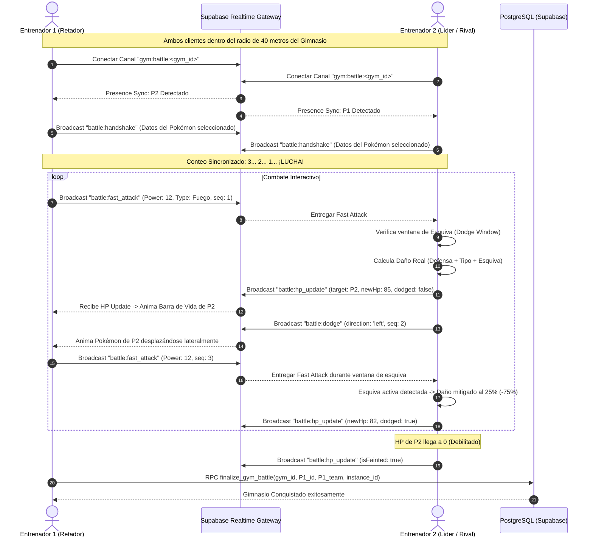

# Módulo 6: Inventario, Pokédex y Batallas en Tiempo Real (WebSockets)

Este documento contiene la fundamentación técnica, los modelos matemáticos y de sincronización en red, la guía paso a paso para la sustentación presencial en vivo y el banco de preguntas técnicas para la evaluación del **Módulo 6 (Módulo 5 de la rúbrica oficial)** de *Pokémon GO — Edición Exclusiva Campus UniSabana*.

---

## 1. Fundamentos Técnicos y Modelos Matemáticos

### 1.1 Mochila y Pokédex Integral
- **Segmentación de Interfaz:** Control segmentado en `InventoryScreen.tsx` que alterna dinámicamente entre la vista de **Pokédex & Colección** y la vista de **Mochila de Objetos**.
- **Indexación y Búsqueda Reactiva:** Filtrado compuesto sobre `captured_instances` cruzado con `pokemon_base` en memoria:
  - Búsqueda por subcadena insensible a mayúsculas/minúsculas en nombres y números de Pokédex.
  - Filtrado por tipo elemental primario y secundario mediante chips interactivos.
  - Ordenamiento multidimensional: Puntos de Combate (CP), fecha de captura (timestamp UTC), porcentaje de IV genético y número de Pokédex.

---

### 1.2 Desglose Analítico: Estadísticas Base vs. IVs Individuales (0 a 15)
En el universo competitivo de Pokémon GO, cada espécimen posee un potencial genético individual (*Individual Values - IVs*) compuesto por tres enteros pseudoaleatorios entre 0 y 15 asignados al momento de la captura: `iv_attack`, `iv_defense`, e `iv_hp`.

#### Fórmulas de Cálculo Efectivo:
- **Ataque Efectivo:**
  `Ataque Efectivo = Base Attack + IV Attack`
  (Rango: `Base Attack + 0` a `Base Attack + 15`)
- **Defensa Efectiva:**
  `Defensa Efectiva = Base Defense + IV Defense`
  (Rango: `Base Defense + 0` a `Base Defense + 15`)
- **Salud Máxima (HP):**
  `Max HP = (Base HP * 2) + IV HP + 50`

#### Sistema de Valoración por Estrellas (Appraisal):
- Suma Total de IVs: `Total IV = iv_attack + iv_defense + iv_hp` (Rango: 0 a 45)
- Porcentaje Genético: `Porcentaje IV = (Total IV / 45) * 100`
- **Escala de Calificación:**
  - `0 Estrellas:` 0% a 48.9% (Total IV: 0 a 22) -> Insignia Pizarra `#64748B`
  - `1 Estrella:` 50.0% a 64.4% (Total IV: 23 a 29) -> Insignia Bronce `#D97706`
  - `2 Estrellas:` 66.7% a 80.0% (Total IV: 30 a 36) -> Insignia Plata `#94A3B8`
  - `3 Estrellas:` 82.2% a 97.8% (Total IV: 37 a 44) -> Insignia Oro `#EAB308`
  - `100% Perfecto (Hundo):` 100% exacto (45/45 IVs) -> Insignia Corona Magenta `#EC4899`

---

### 1.3 Arquitectura de Red en Combates en Gimnasios (`supabase.channel`)

Para permitir combates bidireccionales con latencia mínima (< 50 ms) entre dos clientes geolocalizados en el mismo gimnasio del campus:



---

### 1.4 Modelo Matemático de Daño y Mitigación por Esquiva

```text
Multiplicador de Tipo = Consultar Matriz Gen 1 entre Tipo de Movimiento y Tipos del Defensor
                       Valores: 2.0 (Súper eficaz), 0.5 (Poco eficaz), 0.0 (Inmune) o 1.0 (Neutral)

STAB (Same Type Attack Bonus) = 1.2 si el Tipo del Movimiento coincide con algún Tipo del Atacante
                                1.0 en caso contrario

Ratio de Ataque/Defensa = Ataque Efectivo Atacante / Max(1, Defensa Efectiva Defensor)

Daño Base = Piso(0.5 * Potencia * Ratio de Ataque/Defensa * STAB * Multiplicador de Tipo) + 1

Si Esquiva Activa (Ventana de 500 ms tras swipe):
    Daño Final = Max(1, Piso(Daño Base * 0.25))   [Mitigación estricta del 75%]
En caso contrario:
    Daño Final = Daño Base
```

---

### 1.5 Estrategia de Manejo de Concurrencia y Prevención de Race Conditions

1. **Modelo de Autoridad en el Receptor (Receiver-Authoritative Damage):**
   - El cliente atacante solo despacha su intención de ataque con la potencia base y su estadística de ataque.
   - **El receptor es la única fuente de la verdad para su propia salud**: es el único que conoce en el milisegundo exacto si su ventana de esquiva (500 ms) estaba activa al llegar el impacto.
   - El receptor calcula el daño neto, actualiza su barra local y emite el paquete autoritativo `battle:hp_update`. Esto elimina por completo cualquier discrepancia de salud o desincronización entre ambos clientes.
2. **Numeración Monotónica y Deduplicación por UUID:**
   - Cada paquete emitido viaja con un `seqId` incremental (`1, 2, 3...`) y un UUID `packetId`.
   - Si la red celular duplica un paquete, el receptor lo descarta de inmediato al verificar su caché de IDs procesados (`processedPacketIds`).
3. **Bloqueo Pesimista en Base de Datos para Gimnasios (`FOR UPDATE`):**
   - Cuando un combate concluye, la función `finalize_gym_battle` ejecuta en PostgreSQL:
     `SELECT * FROM public.gymnasiums WHERE id = p_gym_id FOR UPDATE;`
   - Si dos jugadores intentan conquistar el gimnasio en el mismo milisegundo, la base de datos serializa las transacciones: el primer jugador adquiere el gimnasio y la segunda transacción lee el estado ya actualizado, impidiendo condiciones de carrera o corrupción de datos.

---

## 2. Guía Paso a Paso para Probar y Sustentar en Vivo

### Paso 1: Exploración de la Mochila de Consumibles y Pokédex
1. Abre la aplicación en el dispositivo físico o emulador.
2. Toca la pestaña **`🎒 Mochila`** en la barra inferior de navegación:
   - **Resultado Verificable:** La pantalla presenta dos pestañas segmentadas: `[ 📖 Pokédex ]` y `[ 🎒 Mochila ]`.
3. Selecciona la pestaña **`🎒 Mochila`**:
   - **Resultado Verificable:** Se despliegan las 6 categorías de consumibles (Pokéball, Superball, Ultraball, Poción, Superpoción y Revivir) con sus existencias reales sincronizadas desde Supabase (`user_inventory`).

### Paso 2: Filtrado Dinámico y Ordenamiento de la Pokédex
1. Regresa a la pestaña **`📖 Pokédex`**:
   - Observa el encabezado superior: despliega el conteo de especies únicas registradas sobre 151 (ej. `Especies Registradas: 35 / 151`).
2. Escribe una subcadena en la barra de búsqueda (ej. *"Char"* o *"Pika"*):
   - **Resultado Verificable:** La cuadrícula filtra instantáneamente a las criaturas coincidentes en tiempo real.
3. Toca el chip de tipo elemental **`FUEGO`** o **`AGUA`**:
   - **Resultado Verificable:** La lista muestra exclusivamente criaturas que poseen ese tipo elemental primario o secundario.
4. Alterna los botones de ordenamiento: `Mayor CP`, `Mejor IV%`, `Recientes`, `N.º Pokédex`:
   - **Resultado Verificable:** La grilla se reordena de forma inmediata y suave.

### Paso 3: Inspección de Estadísticas Base vs. IVs Individuales Obtenidos
1. Toca cualquier tarjeta de Pokémon en la grilla (ej. Charizard o Pikachu):
   - **Resultado Verificable:** Se abre el modal de detalle a pantalla completa con:
     - Sprite animado de Generación 5 de PokemonDB (`expo-image`).
     - Badges cromáticos oficiales del tipo elemental.
     - Barra de salud interactiva (`PS / Max HP`).
     - Tarjeta de **Valoración del Entrenador (Appraisal)**: Calificación de 0 a 3 estrellas según el porcentaje de IV (o distintivo `👑 100% PERFECTO` si suma 45/45).
     - Gráfico comparativo de tres barras:
       - **⚔️ Ataque:** Segmento base en gris pizarra + Bono IV (0 a 15) en ámbar brillante.
       - **🛡️ Defensa:** Segmento base + Bono IV.
       - **❤️ Salud:** Segmento base + Bono IV.
     - Ficha técnica de **Movimientos**: Ataque Rápido y Ataque Cargado con tipo, potencia y energía.

### Paso 4: Curación y Medicina en Tiempo Real (Poción y Revivir)
1. Ve a la pestaña **`🎒 Mochila`** y localiza la tarjeta de **Poción** o **Superpoción**.
2. Presiona el botón **`💊 Usar Medicina`**:
   - **Resultado Verificable:** Se abre el modal `ConsumableUseModal` listando únicamente las criaturas disponibles.
3. Selecciona una criatura con salud reducida:
   - **Resultado Verificable:** Se ejecuta la función almacenada `apply_item_to_pokemon` en Supabase; la barra de vida de la criatura se incrementa en +20 PS (o +50 PS), el stock de pociones disminuye en 1 unidad en la base de datos y se muestra la alerta de confirmación.

### Paso 5: Geofencing Estricto de Gimnasio
1. Dirígete a la pestaña **`🗺️ Mapa`**.
2. Toca un marcador de Gimnasio (`🏟️`) que esté a más de 40 metros de tu posición:
   - **Resultado Verificable:** El modal muestra `⚠️ Demasiado lejos (Xm)` y el botón de combate se encuentra bloqueado con advertencia de proximidad.
3. Acércate o utiliza una posición dentro de los 40 metros:
   - **Resultado Verificable:** El badge cambia a verde `📍 En rango de combate (Xm)` y se desbloquea el botón `⚔️ Desafiar Gimnasio`.

### Paso 6: Combate en Tiempo Real con WebSockets (`supabase.channel`)
1. Presiona `⚔️ Desafiar Gimnasio`:
   - Navega a la pantalla completa de combate `GymBattleScreen`.
2. Selecciona a tu combatiente entre tus criaturas disponibles y pulsa `⚔️ Entrar a la Arena`.
3. Inicia el conteo regresivo sincronizado: `3... 2... 1... ¡LUCHA!`.
4. **Mecánica de Ataque Rápido (Tap continuo):**
   - Toca rápidamente la pantalla: el Pokémon propio se impulsa hacia adelante, inflige daño al rival y carga la barra de energía inferior.
5. **Mecánica de Esquiva (Swipe Gesture):**
   - Cuando el oponente ataque, desliza el dedo hacia la izquierda o derecha: el sprite esquiva lateralmente con animación `withTiming`, activando el mensaje dorado `⚡ ¡Esquiva Activa!` y reduciendo el 75% del daño recibido.
6. **Mecánica de Ataque Cargado:**
   - Al llenarse la barra de energía, el botón central de ataque cargado se ilumina. Presiónalo para desatar el ataque especial con animación y texto flotante.
7. **Resolución Atómica del Gimnasio:**
   - Al reducir la salud del rival a 0 HP, la aplicación despliega `🏆 ¡VICTORIA EN EL GIMNASIO!` y ejecuta el RPC `finalize_gym_battle` en PostgreSQL con bloqueo pesimista de fila, transfiriendo el liderazgo del gimnasio al equipo del jugador.

---

## 3. Recompilación Nativa y Ejecución

Dado que este módulo integra `@supabase/supabase-js` para Realtime WebSockets, gestos avanzados con `react-native-gesture-handler` e interpolación con `react-native-reanimated`, la aplicación opera sobre la build de desarrollo nativa:

```bash
# Verificación estática de tipos
npx tsc --noEmit

# Verificación de linter
npx expo lint

# Ejecución en dispositivo Android físico o emulador con dev client
npx expo start --dev-client
```

> **Nota para la Sustentación:** No se requieren librerías nativas adicionales a las ya compiladas en la APK de desarrollo de la Etapa 5.

---

## 4. Banco de Preguntas Técnicas para la Sustentación Oral (100% de la Nota)

### Pregunta 1: ¿Por qué en un sistema peer-to-peer móvil con WebSockets se utiliza el modelo de "Autoridad del Receptor" (Receiver-Authoritative Damage) y no el del atacante?
**Respuesta Modelo:**
> *"En redes celulares móviles existe jitter y latencia asimétrica (entre 50 y 250 ms). Si el atacante fuera quien calcula el daño y la salud del defensor, existiría una condición de carrera crítica al momento de la esquiva: el atacante emitiría un golpe a daño completo sin saber que el defensor realizó un gesto de swipe apenas 30 ms antes, generando desincronización y frustración en el usuario.
> Al adoptar el modelo de Autoridad del Receptor, el atacante únicamente reporta la intención de ataque (`battle:fast_attack` con potencia y tipo). El cliente que recibe el golpe es la única fuente de la verdad para sus propios Puntos de Salud, ya que conoce con precisión de microsegundos en su propio hilo de UI si su ventana de esquiva (`isDodging = true`, 500 ms) estaba activa cuando el golpe aterrizó. El receptor descuenta la vida, aplica la mitigación del 75% si esquivó y transmite un paquete autoritativo `battle:hp_update`. De esta manera se evita la carrera y ambos dispositivos convergen exactamente en el mismo valor de salud."*

---

### Pregunta 2: ¿Cómo se previenen las condiciones de carrera y los paquetes duplicados o fuera de orden en el canal de WebSockets de Supabase?
**Respuesta Modelo:**
> *"Implementamos dos mecanismos en `src/services/battleRealtime.ts`:
> 1. **Numeración Monotónica (`seqId`):** Cada paquete emitido lleva un contador entero estrictamente incremental (1, 2, 3...) y una marca de tiempo UTC. Si por fluctuaciones de red un paquete llega fuera de orden respecto al último estado procesado, el sistema sabe cuál es el orden cronológico estricto de los eventos.
> 2. **Deduplicación por UUID (`packetId`):** Cada paquete incluye un identificador único en formato `${userId}-${seqId}-${timestamp}`. El receptor mantiene una estructura `Set<string>` en memoria con los últimos IDs procesados. Si un paquete es retransmitido por la pasarela de WebSockets debido a un reintento de transporte, el receptor verifica el `Set` y lo descarta instantáneamente en tiempo O(1), impidiendo que un ataque o actualización de daño se contabilice dos veces."*

---

### Pregunta 3: ¿Qué ocurre a nivel de base de datos relacional si dos jugadores derrotan al defensor de un gimnasio en el mismo milisegundo? ¿Cómo se garantiza la consistencia ACID?
**Respuesta Modelo:**
> *"Para prevenir la sobreescritura concurrente (Lost Update Anomaly), la asignación del gimnasio no se realiza mediante un simple `UPDATE` en cliente, sino a través de la función almacenada de PostgreSQL `finalize_gym_battle` ejecutada con nivel de aislamiento serializable mediante bloqueo pesimista:
> `SELECT * FROM public.gymnasiums WHERE id = p_gym_id FOR UPDATE;`
> La cláusula `FOR UPDATE` adquiere un candado exclusivo a nivel de fila sobre el registro del gimnasio. La primera transacción en llegar bloquea la fila, actualiza el equipo ganador y libera el bloqueo. La segunda transacción concurrente se suspende hasta que la primera hace `COMMIT`; cuando la segunda adquiere el candado, lee el nuevo equipo líder ya actualizado sin corromper la tabla ni sobreescribir datos en conflicto."*

---

### Pregunta 4: ¿Cuál es el fundamento matemático del cálculo de daño en combate y cómo se relacionan las estadísticas base con los IVs obtenidos al capturar?
**Respuesta Modelo:**
> *"El daño se calcula de forma determinística en `src/services/battleEngine.ts` siguiendo la fórmula oficial de combate:
> `Daño Base = Piso(0.5 * Potencia * (Ataque Efectivo / Defensa Efectiva) * STAB * Multiplicador de Tipo) + 1`
> Donde:
> - `Ataque Efectivo = Base Attack + IV Attack (0 a 15)`
> - `Defensa Efectiva = Base Defense + IV Defense (0 a 15)`
> - `STAB` vale 1.2 si el tipo del movimiento coincide con el tipo del atacante, o 1.0 en caso contrario.
> - `Multiplicador de Tipo` es 2.0x (súper eficaz), 0.5x (poco eficaz), 0.0x (inmune) o 1.0x (neutral), derivado de la matriz de Gen 1.
> Si el defensor esquivó dentro de la ventana de 500 ms tras el swipe lateral, el daño se mitiga al 25% (`Daño Final = Max(1, Piso(Daño Base * 0.25))`), absorbiendo el 75% del impacto."*

---

### Pregunta 5: ¿Cómo se manejan la memoria y el ciclo de vida de los WebSockets en React Native para evitar memory leaks al navegar entre pantallas?
**Respuesta Modelo:**
> *"En `GymBattleScreen.tsx` el ciclo de vida del canal de WebSockets se encuentra encapsulado en un `useEffect`:
> 1. Al montar la pantalla, se suscribe al canal `gym:battle:<gym_id>` mediante `realtime.connect()`, enlazando listeners de `presence` y `broadcast`.
> 2. La función de limpieza (*cleanup function*) del `useEffect` garantiza que al desmontar la pantalla o retroceder al mapa:
>    - Se invoca `channel.unsubscribe()` cerrando activamente la conexión de transporte y retirando la presencia del usuario.
>    - Se limpian los temporizadores activos en background (`clearInterval` del bot defensor y `clearTimeout` de la ventana de esquiva).
>    - Se vacía el `Set` de deduplicación de paquetes en memoria.
> Esto garantiza que no queden listeners zombi en el hilo de JavaScript ni conexiones colgadas en el gateway de Supabase consumiendo ancho de banda o memoria."*
